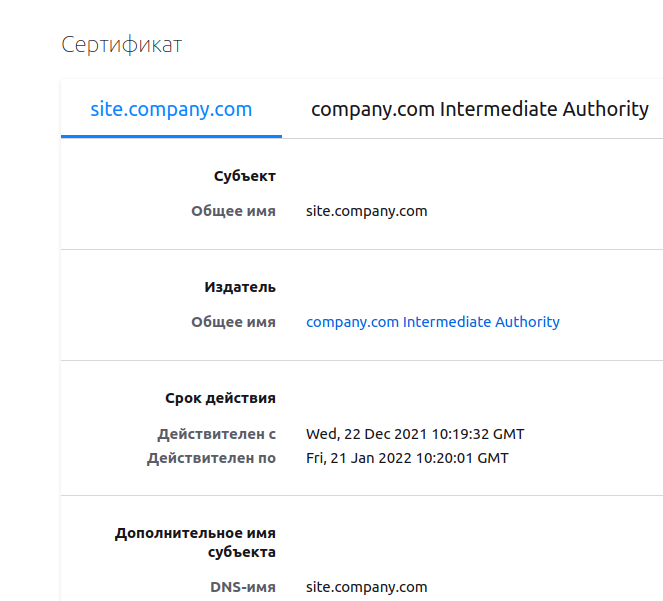

# **Курсовая работа по итогам модуля "DevOps и системное администрирование"**

# *1. Создание и запуск виртуальной машины Linux.*

Vagrant файл:

```
# -*- mode: ruby -*-
# vi: set ft=ruby :

Vagrant.configure("2") do |config|
  config.vm.box = "bento/ubuntu-20.04"
  config.vm.provider "virtualbox" do |vbx|
    vbx.memory = "2048"
    vbx.cpus = "2"
  end
  config.vm.network "private_network", ip: "192.168.10.10"
end
```

```
vagrant up
```

# *2. Установка ufw и разрешение сессий к этой машине на порты 22 и 443*
В исползуемой нами ОС (Ubuntu-20.04) ufw уже установлен. Выполним настройку согласно требований:

```
vagrant@vagrant:~$ sudo ufw allow in on lo from 0.0.0.0/0 to 0.0.0.0/0
vagrant@vagrant:~$ sudo ufw allow in on eth1 from 192.168.10.0/24 to 192.168.10.10 port 22
Rules updated
vagrant@vagrant:~$ sudo ufw allow in on eth1 from 192.168.10.0/24 to 192.168.10.10 port 443
Rules updated
vagrant@vagrant:~$ sudo ufw allow in on eth0 from 10.0.2.0/24 to 10.0.2.15 port 22
vagrant@vagrant:~$ sudo ufw enable
Command may disrupt existing ssh connections. Proceed with operation (y|n)? y
Firewall is active and enabled on system startup
vagrant@vagrant:~$ sudo ufw status verbose
Status: active
Logging: on (low)
Default: deny (incoming), allow (outgoing), disabled (routed)
New profiles: skip

To                         Action      From
--                         ------      ----
Anywhere on lo             ALLOW IN    Anywhere                  
192.168.10.10 22 on eth1   ALLOW IN    192.168.10.0/24           
192.168.10.10 443 on eth1  ALLOW IN    192.168.10.0/24
10.0.2.15 22 on eth0       ALLOW IN    10.0.2.0/24
```

# *3. Установка hashicorp vault*
В командной строке виртуальной машины выполним:

```
curl -fsSL https://apt.releases.hashicorp.com/gpg | sudo apt-key add -
sudo apt-add-repository "deb [arch=amd64] https://apt.releases.hashicorp.com $(lsb_release -cs) main"
sudo apt-get update && sudo apt-get install vault
```

Этим мы добавим актуальные ключи, репозиторий и установим сам пакет 'vault'

```
vagrant@vagrant:~$ curl -fsSL https://apt.releases.hashicorp.com/gpg | sudo apt-key add -
OK
vagrant@vagrant:~$ sudo apt-add-repository "deb [arch=amd64] https://apt.releases.hashicorp.com $(lsb_release -cs) main"
Get:1 https://apt.releases.hashicorp.com focal InRelease [9495 B]
....
Get:35 http://archive.ubuntu.com/ubuntu focal-backports/universe amd64 Packages [18.9 kB]
Get:36 http://archive.ubuntu.com/ubuntu focal-backports/universe Translation-en [7492 B]
Fetched 8880 kB in 6s (1592 kB/s)                                
Reading package lists... Done
vagrant@vagrant:~$ sudo apt-get update && sudo apt-get install vault
Hit:1 https://apt.releases.hashicorp.com focal InRelease
Hit:2 http://archive.ubuntu.com/ubuntu focal InRelease
Hit:3 http://security.ubuntu.com/ubuntu focal-security InRelease
Hit:4 http://archive.ubuntu.com/ubuntu focal-updates InRelease
Hit:5 http://archive.ubuntu.com/ubuntu focal-backports InRelease
Reading package lists... Done
Reading package lists... Done
Building dependency tree       
Reading state information... Done
The following NEW packages will be installed:
  vault
0 upgraded, 1 newly installed, 0 to remove and 108 not upgraded.
Need to get 69.4 MB of archives.
After this operation, 188 MB of additional disk space will be used.
Get:1 https://apt.releases.hashicorp.com focal/main amd64 vault amd64 1.9.1 [69.4 MB]
Fetched 69.4 MB in 31s (2221 kB/s)                                                                                                                   
Selecting previously unselected package vault.
(Reading database ... 41552 files and directories currently installed.)
Preparing to unpack .../archives/vault_1.9.1_amd64.deb ...
Unpacking vault (1.9.1) ...
Setting up vault (1.9.1) ...
Generating Vault TLS key and self-signed certificate...
Generating a RSA private key
........................................................++++
...............................................................................................................++++
writing new private key to 'tls.key'
-----
Vault TLS key and self-signed certificate have been generated in '/opt/vault/tls'.
```

# *4. Cоздание центра сертификации и выпуск сертификатов*
Для работы нам потребуется утилита 'jq', установим её:

```
vagrant@vagrant:~$ sudo apt install jq
Reading package lists... Done
Building dependency tree       
Reading state information... Done
The following additional packages will be installed:
  libjq1 libonig5
The following NEW packages will be installed:
  jq libjq1 libonig5
0 upgraded, 3 newly installed, 0 to remove and 108 not upgraded.
Need to get 313 kB of archives.
After this operation, 1062 kB of additional disk space will be used.
Do you want to continue? [Y/n] Y
Get:1 http://archive.ubuntu.com/ubuntu focal/universe amd64 libonig5 amd64 6.9.4-1 [142 kB]
Get:2 http://archive.ubuntu.com/ubuntu focal-updates/universe amd64 libjq1 amd64 1.6-1ubuntu0.20.04.1 [121 kB]
Get:3 http://archive.ubuntu.com/ubuntu focal-updates/universe amd64 jq amd64 1.6-1ubuntu0.20.04.1 [50.2 kB]
Fetched 313 kB in 1s (340 kB/s)
Selecting previously unselected package libonig5:amd64.
(Reading database ... 41558 files and directories currently installed.)
Preparing to unpack .../libonig5_6.9.4-1_amd64.deb ...
Unpacking libonig5:amd64 (6.9.4-1) ...
Selecting previously unselected package libjq1:amd64.
Preparing to unpack .../libjq1_1.6-1ubuntu0.20.04.1_amd64.deb ...
Unpacking libjq1:amd64 (1.6-1ubuntu0.20.04.1) ...
Selecting previously unselected package jq.
Preparing to unpack .../jq_1.6-1ubuntu0.20.04.1_amd64.deb ...
Unpacking jq (1.6-1ubuntu0.20.04.1) ...
Setting up libonig5:amd64 (6.9.4-1) ...
Setting up libjq1:amd64 (1.6-1ubuntu0.20.04.1) ...
Setting up jq (1.6-1ubuntu0.20.04.1) ...
Processing triggers for man-db (2.9.1-1) ...
Processing triggers for libc-bin (2.31-0ubuntu9.2) ...
```

Запустим сервер в Development режиме:

```
$ vault server -dev -dev-root-token-id root
```

В данном режиме все настройки, ключи и сертификаты остаются в оперативной памяти и после остановки сервиса не сохраняются. 

Переключимся в другой терминал и создадим новую ssh сессию:

```
user@linuxvb:~/NETOLOGY/FinLabMod1$ ssh vagrant@192.168.10.10
vagrant@192.168.10.10's password: 
Welcome to Ubuntu 20.04.2 LTS (GNU/Linux 5.4.0-80-generic x86_64)

 * Documentation:  https://help.ubuntu.com
 * Management:     https://landscape.canonical.com
 * Support:        https://ubuntu.com/advantage

  System information as of Wed 22 Dec 2021 07:56:21 AM UTC

  System load:  0.03              Processes:             115
  Usage of /:   2.9% of 61.31GB   Users logged in:       1
  Memory usage: 8%                IPv4 address for eth0: 10.0.2.15
  Swap usage:   0%                IPv4 address for eth1: 192.168.10.10


This system is built by the Bento project by Chef Software
More information can be found at https://github.com/chef/bento
Last login: Wed Dec 22 07:50:41 2021 from 10.0.2.2
vagrant@vagrant:~$
```

Для удобства установим переменные окружения:

```
vagrant@vagrant:~$ export VAULT_ADDR=http://127.0.0.1:8200
vagrant@vagrant:~$ export VAULT_TOKEN=root
```

Включим pki:

```
root@vagrant:~# vault secrets enable pki
Success! Enabled the pki secrets engine at: pki/
root@vagrant:~# vault secrets tune -max-lease-ttl=87600h pki
Success! Tuned the secrets engine at: pki/
```

И сгенерируем корневой самоподписанный сертификат:

```
root@vagrant:~# vault write -field=certificate pki/root/generate/internal common_name="company.com" ttl=87600h > CA_cert.crt
```

Сконфигурируем ссылки с корневым сертификатом и списком отозванных сертификатов:

```
root@vagrant:~# vault write pki/config/urls issuing_certificates="$VAULT_ADDR/v1/pki/ca" crl_distribution_points="$VAULT_ADDR/v1/pki/crl"
Success! Data written to: pki/config/urls
```

Создадим промежуточный центр сертификации:

```
root@vagrant:~# vault secrets enable -path=pki_int pki
Success! Enabled the pki secrets engine at: pki_int/

root@vagrant:~# vault secrets tune -max-lease-ttl=43800h pki_int
Success! Tuned the secrets engine at: pki_int/
```

Создадим запрос на выдачу сертификата для промежуточного центра сертификации:

```
root@vagrant:~# vault write -format=json pki_int/intermediate/generate/internal common_name="company.com Intermediate Authority" | jq -r '.data.csr' > pki_intermediate.csr
```

Подпишем его корневым сертификатом:

```
root@vagrant:~# vault write -format=json pki/root/sign-intermediate csr=@pki_intermediate.csr format=pem_bundle ttl="43800h" | jq -r '.data.certificate' > intermediate.cert.pem
```

И импортируем его в Vault:

```
root@vagrant:~# vault write pki_int/intermediate/set-signed certificate=@intermediate.cert.pem
Success! Data written to: pki_int/intermediate/set-signed
```

Создадим роль для выдачи сертификата:

```
root@vagrant:~# vault write pki_int/roles/company-dot-com allowed_domains="company.com" allow_subdomains=true max_ttl="720h"
Success! Data written to: pki_int/roles/company-dot-com
```

Запросим сертификат и ключ для домена 'site.company.com'

```
root@vagrant:~# vault write -format=json pki_int/issue/company-dot-com common_name="site.company.com" ttl="720h" > site.company.com.crt
```
Сгенерированные ключ и сертификат мы сохранили в файле 'site.company.com.crt'. Сохраним их по отдельности:

```
root@vagrant:~# cat site.company.com.crt | jq -r .data.private_key > site.company.com.crt.key
root@vagrant:~# cat site.company.com.crt | jq -r .data.certificate > site.company.com.crt.pem
root@vagrant:~# cat site.company.com.crt | jq -r .data.issuing_ca >> site.company.com.crt.pem
```

# *5. Установка корневого сертификата в доверенные в хостовой системе.*

Скопируем сертификат на хостовую систему:

```
root@vagrant:~# cp CA_cert.crt /vagrant/
```

И импортируем его в сертификаты браузера:


# *6. Установка nginx.*

```
root@vagrant:~# apt install nginx -y
Reading package lists... Done
Building dependency tree       
Reading state information... Done
The following additional packages will be installed:
  fontconfig-config fonts-dejavu-core libfontconfig1 libgd3 libjbig0 libjpeg-turbo8 libjpeg8 libnginx-mod-http-image-filter
  libnginx-mod-http-xslt-filter libnginx-mod-mail libnginx-mod-stream libtiff5 libwebp6 libx11-6 libx11-data libxcb1 libxpm4 nginx-common nginx-core
Suggested packages:
....
Processing triggers for systemd (245.4-4ubuntu3.11) ...
Processing triggers for man-db (2.9.1-1) ...
Processing triggers for libc-bin (2.31-0ubuntu9.2) ...
root@vagrant:~# 
```

# *7. Настройка https на nginx*

Скопируем сертификат и ключ в папку Nginx:

```
root@vagrant:~# cp site.company.com.crt.* /etc/nginx/
```

Изменим секцию 'server' в конфигурационном файле nginx '/etc/nginx/sites-enabled/default':

```
# Default server configuration
#
server {
	#listen 80 default_server;
	#listen [::]:80 default_server;

	# SSL configuration
	#
	listen 443 ssl;
	listen [::]:443 ssl;
    ssl_certificate     site.company.com.crt.pem;
    ssl_certificate_key site.company.com.crt.key;
	server_name site.company.com;

	root /var/www/html;

	# Add index.php to the list if you are using PHP
	index index.html index.htm index.nginx-debian.html;

	location / {
		# First attempt to serve request as file, then
		# as directory, then fall back to displaying a 404.
		try_files $uri $uri/ =404;
	}

}

```

И перезапустим сервис nginx:

```
root@vagrant:~# systemctl restart nginx
root@vagrant:~# systemctl status nginx
● nginx.service - A high performance web server and a reverse proxy server
     Loaded: loaded (/lib/systemd/system/nginx.service; enabled; vendor preset: enabled)
     Active: active (running) since Wed 2021-12-22 09:06:06 UTC; 5s ago
       Docs: man:nginx(8)
    Process: 2392 ExecStartPre=/usr/sbin/nginx -t -q -g daemon on; master_process on; (code=exited, status=0/SUCCESS)
    Process: 2404 ExecStart=/usr/sbin/nginx -g daemon on; master_process on; (code=exited, status=0/SUCCESS)
   Main PID: 2406 (nginx)
      Tasks: 3 (limit: 2279)
     Memory: 3.5M
     CGroup: /system.slice/nginx.service
             ├─2406 nginx: master process /usr/sbin/nginx -g daemon on; master_process on;
             ├─2407 nginx: worker process
             └─2408 nginx: worker process
```

# *8. Https страница в браузере на хосте*

Сертификат выдан на имя 'site.company.com'. Если мы обратимся по IP адресу, то в браузере будет выдаваться предупреждение. Внесём IP адрес и имя в файл hosts хостовой машины:

```
192.168.10.10	site.company.com
```

Откроем страницу в браузере:


Страница открылась без предупреждений о недоверенном узле, т.к. сертифкат действительный и подписан доверенным центром сертификации.

# *9. Скрипт для генерации нового сертификата в vault*

```
#!/usr/bin/env bash

export VAULT_ADDR=http://127.0.0.1:8200
export VAULT_TOKEN=root

vault write -format=json pki_int/issue/company-dot-com common_name="site.company.com" ttl="720h" > site.company.com.crt

cat site.company.com.crt | jq -r .data.private_key > /etc/nginx/site.company.com.crt.key
cat site.company.com.crt | jq -r .data.certificate > /etc/nginx/site.company.com.crt.pem
cat site.company.com.crt | jq -r .data.issuing_ca >> /etc/nginx/site.company.com.crt.pem

systemctl restart nginx
```

# *10. Запуск скрипта по расписанию в crontab*

Для проверки запланируем запуск скрипта каждые 10 минут. Добавим в файл '/etc/crontab' строчку:

```
*/10 * * * *    root    /root/site_crt_gen.sh
```

Дождёмся запуска по расписанию:

```
root@vagrant:~# journalctl -u cron -f
-- Logs begin at Fri 2021-12-17 08:23:47 UTC. --
....
Dec 22 10:17:01 vagrant CRON[2549]: (root) CMD (   cd / && run-parts --report /etc/cron.hourly)
Dec 22 10:17:01 vagrant CRON[2546]: pam_unix(cron:session): session closed for user root
Dec 22 10:20:01 vagrant CRON[2557]: pam_unix(cron:session): session opened for user root by (uid=0)
Dec 22 10:20:01 vagrant CRON[2560]: (root) CMD (/root/site_crt_gen.sh^I)
Dec 22 10:20:02 vagrant CRON[2557]: pam_unix(cron:session): session closed for user root
```

Из лога видим, что в 10:20:01 было выполнение скрипта 'site_crt_gen.sh'. Проверим дату создания файлов сертификата и ключа:

```
root@vagrant:~# ls -la /etc/nginx/site.company.com.crt.*
-rw-r--r-- 1 root root 1675 Dec 22 10:20 /etc/nginx/site.company.com.crt.key
-rw-r--r-- 1 root root 2567 Dec 22 10:20 /etc/nginx/site.company.com.crt.pem
```

Даты файлов обновились.

Проверим сертификат в браузере хостовой машины:



Срок действия у сертификата обновился, страница отображается как доверенный узел.