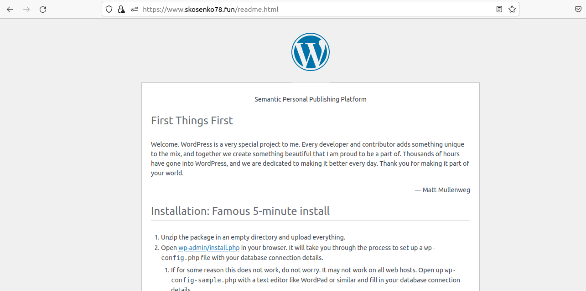
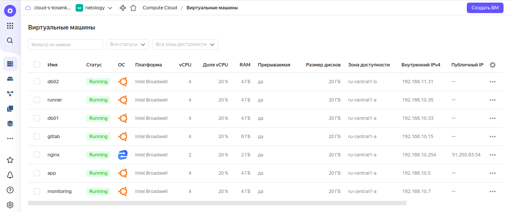

# **Дипломный практикум в YandexCloud**

## 1. Регистрация доменного имени

### 1.1. Доменное имя
Зарегистрировано доменное имя `skosenko78.fun`


### 1.2. Управление зоной
Управление зоной делегировано серверам yandexcloud.


## 2. Создание инфраструктуры

### 2.1.Создайте сервисный аккаунт, который будет в дальнейшем использоваться Terraform для работы с инфраструктурой

Создание сервисного аккаунта:

```
yc iam service-account create --name terra-robot
id: aje4h0j2i352da28q9k7
folder_id: b1g8t7bb3jnhfrkoa6uk
created_at: "2022-07-19T12:48:39.957327905Z"
name: terra-robot
```

Сервисному аккаунту необходимо назначить роль, т.е. указать что этот аккаунт может делать в нашем облаке. Назначим этой сервисной учётноной записи роль 'Editor':

```
yc iam service-account get terra-robot
id: aje4h0j2i352da28q9k7
folder_id: b1g8t7bb3jnhfrkoa6uk
created_at: "2022-07-19T12:48:39Z"
name: terra-robot

yc resource-manager folder add-access-binding netology --role editor --subject serviceAccount:aje4h0j2i352da28q9k7
```

Получим IAM-токен для авторизации сервисной учётной записи. Для этого создадим авторизованные ключи (пара открытый и закрытый):

```
yc iam key create --service-account-name terra-robot --output key.json
id: ajeentnp5cscf0e9nli4
service_account_id: aje4h0j2i352da28q9k7
created_at: "2022-07-19T13:35:34.009305557Z"
key_algorithm: RSA_2048
```

И получим token:

```
yc iam create-token 
<token>

```

Укажем все эти данные в файле `src/terraform/key.json` для того, чтобы не указывать их постоянно при запуске инфраструктуры.

### 2.2. Подготовьте backend S3 bucket для Terraform в созданном YC аккаунте.

Создадим статический ключ доступа для сервисной учётной записи. Этот ключ понадобится для подключения S3 бакета.

```
yc iam service-account list
+----------------------+-------------+
|          ID          |    NAME     |
+----------------------+-------------+
| aje4h0j2i352da28q9k7 | terra-robot |
+----------------------+-------------+

yc iam access-key create --service-account-name terra-robot
access_key:
  id: <value>
  service_account_id: <value>
  created_at: "2022-07-20T09:00:55.123212426Z"
  key_id: <value>
secret: <value>
```

Прежде чем сохранить состояние terraform в бэкэнд, нужно создать S3 бакет. Создавать его будем тем же terraform. Для этого создадим ещё один конфигурационный файл `main.tf` в папке `src/s3-terraform/`. В ту же папку скопируем файл `key.json`

Статический ключ укажем в переменных окружения:
```
export YC_STORAGE_ACCESS_KEY=<key_id>
export YC_STORAGE_SECRET_KEY=<secret>
```

cloud_id, folder_id и имя bucket указываются в файле `variables.tf`.

Создадим S3 бакет:

```
terraform apply -auto-approve

Terraform used the selected providers to generate the following execution plan. Resource actions are indicated with the following symbols:
  + create

Terraform will perform the following actions:

  # yandex_storage_bucket.tf-state will be created
  + resource "yandex_storage_bucket" "tf-state" {
      + acl                   = "private"
      + bucket                = "terraform-running-state"
      + bucket_domain_name    = (known after apply)
      + default_storage_class = (known after apply)
      + folder_id             = (known after apply)
      + force_destroy         = false
      + id                    = (known after apply)
      + website_domain        = (known after apply)
      + website_endpoint      = (known after apply)

      + anonymous_access_flags {
          + list = (known after apply)
          + read = (known after apply)
        }

      + versioning {
          + enabled = (known after apply)
        }
    }

Plan: 1 to add, 0 to change, 0 to destroy.
yandex_storage_bucket.tf-state: Creating...
yandex_storage_bucket.tf-state: Still creating... [10s elapsed]
yandex_storage_bucket.tf-state: Still creating... [20s elapsed]
yandex_storage_bucket.tf-state: Still creating... [30s elapsed]
yandex_storage_bucket.tf-state: Still creating... [40s elapsed]
yandex_storage_bucket.tf-state: Still creating... [50s elapsed]
yandex_storage_bucket.tf-state: Still creating... [1m0s elapsed]
yandex_storage_bucket.tf-state: Creation complete after 1m2s [id=terraform-running-state]

Apply complete! Resources: 1 added, 0 changed, 0 destroyed.

```


Теперь можно добавить бэкэнд в основную конфигурацию (файл `src/terraform/provider.tf`):

```
backend "s3" {
    endpoint   = "storage.yandexcloud.net"
    bucket     = "terraform-running-state"
    region     = "ru-central1"
    key        = "s3/terraform.tfstate"

    skip_region_validation      = true
    skip_credentials_validation = true
  }
```
### 2.3. Настройте workspaces

Инициализируем проект, выполнив terraform init:

Статичный ключ бэкэнда укажем при инициализации terraform:

```
terraform init -backend-config="access_key=<key_id>" -backend-config="secret_key=<secret>"
```

Создадим два воркспейса stage и prod:

```
terraform workspace new stage
Created and switched to workspace "stage"!

You're now on a new, empty workspace. Workspaces isolate their state,
so if you run "terraform plan" Terraform will not see any existing state
for this configuration.
```

```
terraform workspace new prod
Created and switched to workspace "prod"!

You're now on a new, empty workspace. Workspaces isolate their state,
so if you run "terraform plan" Terraform will not see any existing state
for this configuration.

terraform workspace list
  default
  prod
* stage
```

### 2.4. Создайте VPC с подсетями в разных зонах доступности.

Сеть с подсетями описаны в файле `src/terraform/network.tf`

### 2.5. Убедитесь, что теперь вы можете выполнить команды terraform destroy и terraform apply без дополнительных ручных действий.

Команды выполняются.

## 3. Установка Nginx и LetsEncrypt

Конфигурция сервера описана в файле `src/terraform/nginx.tf`. Имя домена, для которого производится настройка, задаётся переменной `domain_name` в файле `src/terraform/variables.tf`

### 3.1. В вашей доменной зоне настроены все A-записи на внешний адрес этого сервера.

В файле `src/terraform/dns.tf` описано создание нужных записей в DNS зоне.

### 3.2. Настроены все upstream для выше указанных URL, куда они сейчас ведут на этом шаге не важно, позже вы их отредактируете и укажите верные значения.

Настройка осуществляется ansible ролью `nginx`. Находится по пути `src/ansible/roles/nginx`

### 3.3. В браузере можно открыть любой из этих URL и увидеть ответ сервера (502 Bad Gateway).


Получение LetsEncrypt сертификатов также осуществляется этой ansible ролью.


## 4. Установка кластера MySQL

Конфигурция серверов описана в файлах `src/terraform/db01.tf` (master) и `src/terraform/db02.tf` (slave). Имя базы, имя пользователя для подключения и пароль задаются соответствующими переменными `wordpress_db_name`, `wordpress_db_user` и `wordpress_db_pass` в файле  `src/terraform/variables.tf`.

Ansible роль `mysql` настраивает MySQL для работы в режиме репликации Master/Slave.Создаёт базу данных c именем, указанном в переменной `wordpress_db_name`. В кластере создаётся пользователь для подключения к базе данных Wordpress. Роль находится в папке `src/ansible/roles/mysql`.

## 5. Установка WordPress

Конфигурция сервера описана в файле `src/terraform/app.tf`. Для web сервера использовался Nginx и Php-fpm. Установка и настройка осуществляется ролью `wordpress`. Роль находится в папке `src/ansible/roles/wordpress`. После настройки можно увидеть стартовую страницу Wordpress:


После первичной настройки:


## 6. Установка Gitlab CE и Gitlab Runner

Конфигурция серверов описана в файлах `src/terraform/gitlab.tf` и `src/terraform/runner.tf`. Установка и настройка осуществляется ролями `gitlab` и `gitlab-runner`. Роли находятся в папках `src/ansible/roles/gitlab` и `src/ansible/roles/gitlab-runner`. Для подключения к Gitlab используется логин `root` и пароль `abc123456789`. Пароль задаётся в переменной роли `gitlab_root_password`.

Интерфейс Gitlab доступен по https:


Роль `gitlab-runner` регистрирует runner на gitlab сервере. Мы можем проверить это после выполнения роли:


Импортируем проект Wordpress по ссылке: https://github.com/wordpress/wordpress.git


Создадим pipeline такого содержания:

```
# This file is a template, and might need editing before it works on your project.
# This is a sample GitLab CI/CD configuration file that should run without any modifications.
# It demonstrates a basic 3 stage CI/CD pipeline. Instead of real tests or scripts,
# it uses echo commands to simulate the pipeline execution.
#
# A pipeline is composed of independent jobs that run scripts, grouped into stages.
# Stages run in sequential order, but jobs within stages run in parallel.
#
# For more information, see: https://docs.gitlab.com/ee/ci/yaml/index.html#stages
#
# You can copy and paste this template into a new `.gitlab-ci.yml` file.
# You should not add this template to an existing `.gitlab-ci.yml` file by using the `include:` keyword.
#
# To contribute improvements to CI/CD templates, please follow the Development guide at:
# https://docs.gitlab.com/ee/development/cicd/templates.html
# This specific template is located at:
# https://gitlab.com/gitlab-org/gitlab/-/blob/master/lib/gitlab/ci/templates/Getting-Started.gitlab-ci.yml

stages:          # List of stages for jobs, and their order of execution
  - deploy

deploy-job:      # This job runs in the deploy stage.
  stage: deploy
  only:
    - tags
  script:
    - echo "Deploying application..."
    - ssh -o StrictHostKeyChecking=no ubuntu@app.skosenko78.fun sudo chown ubuntu:ubuntu /var/www/wordpress/ -R
    - rsync -vz -e "ssh -o StrictHostKeyChecking=no" --exclude ".git*" $CI_PROJECT_DIR/* ubuntu@app.skosenko78.fun:/var/www/wordpress/
    - ssh -o StrictHostKeyChecking=no ubuntu@app.skosenko78.fun sudo chown www-data:www-data /var/www/wordpress/ -R
    - echo "Application successfully deployed."
```


Проверим работу pipeline на статичной странице Wordpress:



Изменим файл readme.html в нашем репозитории, сделаем commit и добавим tag:


Видно, что после добавления tag, pipeline запустился и успешно отработал:


После обновления страницы в браузере можно увидеть, что внесённые изменения были применены на сервер с Wordpress:


## 7. Установка Prometheus, Alert Manager, Node Exporter и Grafana

Конфигурция сервера мониторинга описана в файле `src/terraform/monitoring.tf`. Установка и настройка ПО осуществляется ролями `prometheus`, `grafana`, `alertmanager`. Роли находятся в папках `src/ansible/roles/prometheus`, `src/ansible/roles/grafana`, `src/ansible/roles/alertmanager`. Кроме того, для серверов, которые требуется мониторить, написана роль `node_exporter`. Для серверов MySQL дополнительно применяется роль `mysqld_exporter`, для мониторинга параметров баз данных MySQL.

Для входа в интерфейс Grafana используется логин и пароль по-умолчанию (admin/admin). Dashboard'ы подключаются при разворачивании приложения ролью `grafana`.

Интерфейсы Prometheus, Alert Manager и Grafana доступны по https:


Выключим машину app и проверим работу alertmanager:


После запуска виртуальной машины app сообщение исчезло.


## 8. Запуск стенда

Полностью стенд запускается по `terraform apply -auto-approve`.

Создаются и запускаются виртуальные машины, выполняется playbook `src/ansible/site.yml` применительно к хостам из файла `src/ansible/inventory`, который создается terraform'ом. Создание и настройка итоговой инфраструктуры заняли примерно 30 минут:


