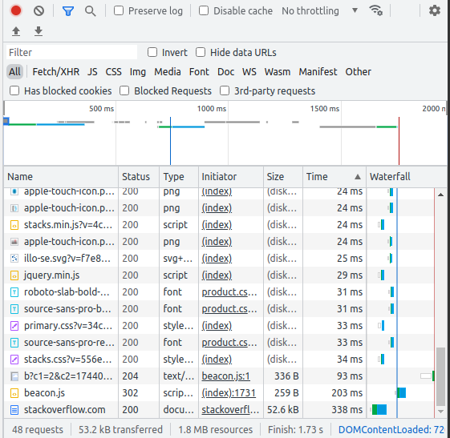
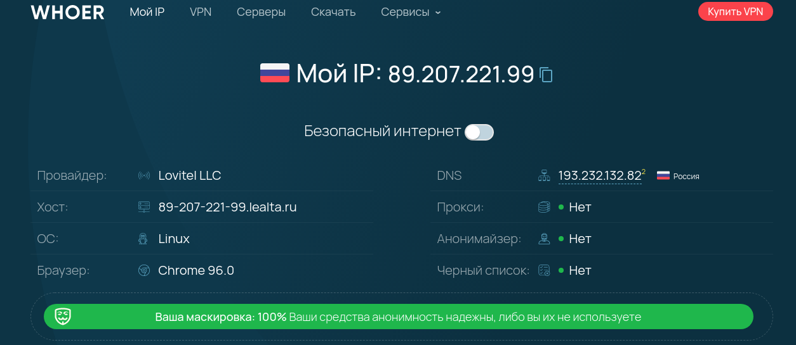

# **3.6. Компьютерные сети, лекция 1**

# *1. Работа c HTTP через телнет.*

```
s_kosenko@linuxvb:~/NETOLOGY/Lab3.6Files$ telnet stackoverflow.com 80
Trying 151.101.1.69...
Connected to stackoverflow.com.
Escape character is '^]'.
GET /questions HTTP/1.0
HOST: stackoverflow.com

HTTP/1.1 301 Moved Permanently
cache-control: no-cache, no-store, must-revalidate
location: https://stackoverflow.com/questions
x-request-guid: 778da80a-e196-4632-a1bb-ea0d6e23c495
feature-policy: microphone 'none'; speaker 'none'
content-security-policy: upgrade-insecure-requests; frame-ancestors 'self' https://stackexchange.com
Accept-Ranges: bytes
Date: Tue, 30 Nov 2021 15:58:40 GMT
Via: 1.1 varnish
Connection: close
X-Served-By: cache-bma1657-BMA
X-Cache: MISS
X-Cache-Hits: 0
X-Timer: S1638287921.572102,VS0,VE101
Vary: Fastly-SSL
X-DNS-Prefetch-Control: off
Set-Cookie: prov=7a831389-12ec-1f35-7ee0-ada2400cc0ea; domain=.stackoverflow.com; expires=Fri, 01-Jan-2055 00:00:00 GMT; path=/; HttpOnly

Connection closed by foreign host.
s_kosenko@linuxvb:~/NETOLOGY/Lab3.6Files$ 
```

Получили код ответа 'HTTP/1.1 301 Moved Permanently' - "Перемещён на постоянной основе". Этот код ответа значит, что URI запрашиваемого ресурса был изменён. 

# *2. Использование консоли разработчика F12 в браузере*

На запрос страницы по адресу 'http://stackoverflow.com' первый ответ:

Request URL: http://stackoverflow.com/
Request Method: GET
Status Code: 307 Internal Redirect
Referrer Policy: strict-origin-when-cross-origin

Так же в ответе есть ссылка для перенаправления: 'Location: https://stackoverflow.com/'

Страница загружалась 1.73 s. Дольше всего обрабатывался запрос с типом 'document'. Длился 338 ms и завершился с кодом 200




# *3. Какой IP адрес у вас в интернете?*

Для определения IP адреса откроем ссылку: https://whoer.net/




# *4. Определить провайдера, AS*

В этот раз используем утилиту 'whois'

```
s_kosenko@linuxvb:~/NETOLOGY$ whois 89.207.221.99
% This is the RIPE Database query service.
% The objects are in RPSL format.
%
% The RIPE Database is subject to Terms and Conditions.
% See http://www.ripe.net/db/support/db-terms-conditions.pdf

% Note: this output has been filtered.
%       To receive output for a database update, use the "-B" flag.

% Information related to '89.207.221.0 - 89.207.221.255'

% Abuse contact for '89.207.221.0 - 89.207.221.255' is 'abuse@lovit.ru'

inetnum:        89.207.221.0 - 89.207.221.255
netname:        LOVIT-SPB-01
geoloc:         59.983999 30.331139
descr:          Lovitel LLC # Saint-Petersburg Network
country:        RU
admin-c:        VSAB-RIPE
tech-c:         VSAB-RIPE
status:         ASSIGNED PA
mnt-by:         MNT-LEALTA-ALL
mnt-by:         MNT-LEALTA-AS
created:        2021-07-08T11:21:59Z
last-modified:  2021-07-26T12:48:50Z
source:         RIPE

person:         Vladimir Sabadash
address:        Varshavskoe highway, 148 Moscow, Russia, 117519
phone:          +74956428561 ext. 521
nic-hdl:        VSAB-RIPE
mnt-by:         MNT-LEALTA-ALL
created:        2021-07-08T11:13:03Z
last-modified:  2021-07-08T11:13:03Z
source:         RIPE

% Information related to '89.207.221.0/24AS41275'

route:          89.207.221.0/24
origin:         AS41275
mnt-by:         MNT-LEALTA-ALL
mnt-by:         MNT-LEALTA-AS
created:        2021-07-08T11:34:15Z
last-modified:  2021-07-08T11:34:15Z
source:         RIPE

% This query was served by the RIPE Database Query Service version 1.101 (BLAARKOP)
```

Из вывода утилиты можно понять, что провайдер 'Lovitel LLC', IP принадежит AS41275

# *5. traceroute на адрес 8.8.8.8*
Используем ключи -A (для отображения AS) и -n (отображать IP, а не имена):

```
s_kosenko@linuxvb:~/NETOLOGY$ traceroute -An 8.8.8.8
traceroute to 8.8.8.8 (8.8.8.8), 30 hops max, 60 byte packets
 1  192.168.88.254 [*]  0.728 ms  1.513 ms  1.956 ms
 2  100.78.0.1 [*]  2.282 ms  2.884 ms  3.174 ms
 3  89.207.221.64 [AS41275]  3.968 ms  4.401 ms  4.844 ms
 4  185.1.152.26 [*]  5.216 ms  7.773 ms 109.239.137.233 [AS31500]  13.819 ms
 5  108.170.250.99 [AS15169]  15.700 ms 108.170.250.34 [AS15169]  15.859 ms 74.125.244.181 [AS15169]  5.970 ms
 6  72.14.232.84 [AS15169]  6.577 ms 209.85.255.136 [AS15169]  17.218 ms 142.251.51.187 [AS15169]  10.580 ms
 7  172.253.79.237 [AS15169]  5.663 ms 74.125.253.94 [AS15169]  21.868 ms 216.239.48.163 [AS15169]  21.709 ms
 8  209.85.251.63 [AS15169]  14.337 ms * 108.170.233.161 [AS15169]  6.172 ms
 9  * * *
10  * * *
11  * * *
12  * * *
13  * * *
14  * * *
15  8.8.8.8 [AS15169]  21.494 ms * *
```
Из вывода утилиты можно увидеть черех какие сети и AS проходит пакет.


# *6. Утилита mtr*

Используем команду 'mtr -z 8.8.8.8'. Наибольшую задержку можно увидеть в поле 'Wrst', в нашем случе это значение 97.8:

```
6. AS15169  142.251.51.187                                     0.0%    10    5.6  36.5   5.5  97.8  38.7
```

# *7. Какие DNS сервера отвечают за доменное имя dns.google?*
Используем утилиту dig:

```
dig NS dns.google

; <<>> DiG 9.16.1-Ubuntu <<>> NS dns.google
;; global options: +cmd
;; Got answer:
;; ->>HEADER<<- opcode: QUERY, status: NOERROR, id: 29748
;; flags: qr rd ra; QUERY: 1, ANSWER: 4, AUTHORITY: 0, ADDITIONAL: 1

;; OPT PSEUDOSECTION:
; EDNS: version: 0, flags:; udp: 65494
;; QUESTION SECTION:
;dns.google.			IN	NS

;; ANSWER SECTION:
dns.google.		5811	IN	NS	ns2.zdns.google.
dns.google.		5811	IN	NS	ns3.zdns.google.
dns.google.		5811	IN	NS	ns4.zdns.google.
dns.google.		5811	IN	NS	ns1.zdns.google.

;; Query time: 0 msec
;; SERVER: 127.0.0.53#53(127.0.0.53)
;; WHEN: Ср дек 01 22:10:04 MSK 2021
;; MSG SIZE  rcvd: 116

```

За зону dns.google отвечают сервера:

```
ns2.zdns.google.
ns3.zdns.google.
ns4.zdns.google.
ns1.zdns.google.
```

А А-записи такие:

```
dig A dns.google

; <<>> DiG 9.16.1-Ubuntu <<>> A dns.google
;; global options: +cmd
;; Got answer:
;; ->>HEADER<<- opcode: QUERY, status: NOERROR, id: 46826
;; flags: qr rd ra; QUERY: 1, ANSWER: 2, AUTHORITY: 0, ADDITIONAL: 1

;; OPT PSEUDOSECTION:
; EDNS: version: 0, flags:; udp: 65494
;; QUESTION SECTION:
;dns.google.			IN	A

;; ANSWER SECTION:
dns.google.		195	IN	A	8.8.4.4
dns.google.		195	IN	A	8.8.8.8

;; Query time: 63 msec
;; SERVER: 127.0.0.53#53(127.0.0.53)
;; WHEN: Ср дек 01 22:12:41 MSK 2021
;; MSG SIZE  rcvd: 71
```

# *8. PTR записи*

Для отображения PTR-записей используется ключ -x утилиты dig:

```
dig -x 8.8.8.8

; <<>> DiG 9.16.1-Ubuntu <<>> -x 8.8.8.8
;; global options: +cmd
;; Got answer:
;; ->>HEADER<<- opcode: QUERY, status: NOERROR, id: 3653
;; flags: qr rd ra; QUERY: 1, ANSWER: 1, AUTHORITY: 0, ADDITIONAL: 1

;; OPT PSEUDOSECTION:
; EDNS: version: 0, flags:; udp: 65494
;; QUESTION SECTION:
;8.8.8.8.in-addr.arpa.		IN	PTR

;; ANSWER SECTION:
8.8.8.8.in-addr.arpa.	4453	IN	PTR	dns.google.

;; Query time: 0 msec
;; SERVER: 127.0.0.53#53(127.0.0.53)
;; WHEN: Ср дек 01 22:14:23 MSK 2021
;; MSG SIZE  rcvd: 73

dig -x 8.8.4.4

; <<>> DiG 9.16.1-Ubuntu <<>> -x 8.8.4.4
;; global options: +cmd
;; Got answer:
;; ->>HEADER<<- opcode: QUERY, status: NOERROR, id: 16823
;; flags: qr rd ra; QUERY: 1, ANSWER: 1, AUTHORITY: 0, ADDITIONAL: 1

;; OPT PSEUDOSECTION:
; EDNS: version: 0, flags:; udp: 65494
;; QUESTION SECTION:
;4.4.8.8.in-addr.arpa.		IN	PTR

;; ANSWER SECTION:
4.4.8.8.in-addr.arpa.	2702	IN	PTR	dns.google.

;; Query time: 35 msec
;; SERVER: 127.0.0.53#53(127.0.0.53)
;; WHEN: Ср дек 01 22:14:28 MSK 2021
;; MSG SIZE  rcvd: 73

```

Доменное имя можно увидеть в 'ANSWER SECTION': dns.google.