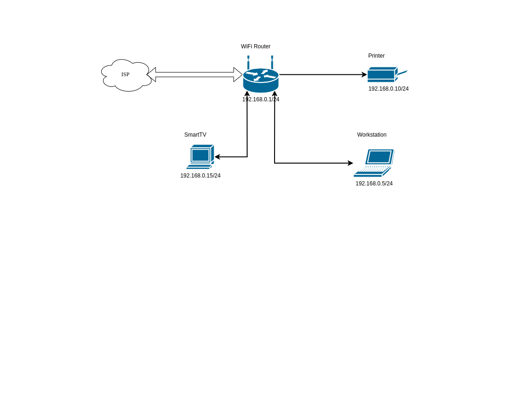

# **3.8. Компьютерные сети, лекция 3**

# *1. Найти маршрут к вашему публичному IP*
Подключимся к публичному маршрутизатору и посмотрим маршрут: 

```
telnet route-views.routeviews.org
Username: rviews
route-views>sh ip route 84.52.111.4   
Routing entry for 84.52.64.0/18
  Known via "bgp 6447", distance 20, metric 0
  Tag 6939, type external
  Last update from 64.71.137.241 1w0d ago
  Routing Descriptor Blocks:
  * 64.71.137.241, from 64.71.137.241, 1w0d ago
      Route metric is 0, traffic share count is 1
      AS Hops 2
      Route tag 6939
      MPLS label: none
route-views>sh bgp 84.52.111.4
BGP routing table entry for 84.52.64.0/18, version 1386167772
Paths: (24 available, best #23, table default)
  Not advertised to any peer
  Refresh Epoch 3
  3303 9002 25408
    217.192.89.50 from 217.192.89.50 (138.187.128.158)
      Origin IGP, localpref 100, valid, external
      Community: 3303:1004 3303:1007 3303:1030 3303:3067 9002:64667
      path 7FE117137550 RPKI State valid
      rx pathid: 0, tx pathid: 0
  Refresh Epoch 1
  4901 6079 9002 25408
    162.250.137.254 from 162.250.137.254 (162.250.137.254)
      Origin IGP, localpref 100, valid, external
      Community: 65000:10100 65000:10300 65000:10400
      path 7FE0284990D0 RPKI State valid
      rx pathid: 0, tx pathid: 0
  Refresh Epoch 1
  7018 1299 25408
    12.0.1.63 from 12.0.1.63 (12.0.1.63)
      Origin IGP, localpref 100, valid, external
      Community: 7018:5000 7018:37232
      path 7FE0C0100F70 RPKI State valid
      rx pathid: 0, tx pathid: 0
  Refresh Epoch 1
  7660 2516 12389 25408
    203.181.248.168 from 203.181.248.168 (203.181.248.168)
      Origin IGP, localpref 100, valid, external
      Community: 2516:1050 7660:9001
      path 7FE0EAC10378 RPKI State valid
      rx pathid: 0, tx pathid: 0
...
...
  Refresh Epoch 1
  19214 174 1299 25408
    208.74.64.40 from 208.74.64.40 (208.74.64.40)
      Origin IGP, localpref 100, valid, external
      Community: 174:21000 174:22013
      path 7FE093CDB168 RPKI State valid
      rx pathid: 0, tx pathid: 0
``` 

# *2. Создание dummy0 интерфейса в Ubuntu*
Посомотрим, что интерфейс dummy0 отсутствует в системе:

```
vagrant@vagrant:~$ ip -br link
lo               UNKNOWN        00:00:00:00:00:00 <LOOPBACK,UP,LOWER_UP> 
eth0             UP             08:00:27:73:60:cf <BROADCAST,MULTICAST,UP,LOWER_UP> 
vagrant@vagrant:~$ 
```

Добавим в файл '/etc/network/interfaces' конфигурацию:

```
auto dummy0
iface dummy0 inet static
        address 10.0.0.1/24
        pre-up ip link add dummy0 type dummy
        post-down ip link del dummy0
```

И перезапустим сервис networking:

```
vagrant@vagrant:~$ sudo service networking restart
```

Модуль dummy подгрузился в ядро и в системе появился dummy интерфейс:

```
vagrant@vagrant:~$ ip -br a
lo               UNKNOWN        127.0.0.1/8 ::1/128 
eth0             UP             10.0.2.15/24 fe80::a00:27ff:fe73:60cf/64 
dummy0           UNKNOWN        10.0.0.1/24 fe80::4868:e3ff:fe17:9911/64 
vagrant@vagrant:~$ 
```
Добавили несколько статических маршрутов. Таблица маршрутизации:

```
vagrant@vagrant:~$ sudo ip route show
default via 10.0.2.2 dev eth0 proto dhcp src 10.0.2.15 metric 100 
10.0.0.0/24 dev dummy0 proto kernel scope link src 10.0.0.1 
10.0.2.0/24 dev eth0 proto kernel scope link src 10.0.2.15 
10.0.2.2 dev eth0 proto dhcp scope link src 10.0.2.15 metric 100 
172.16.1.0/28 via 10.0.2.20 dev eth0 
192.168.0.0/24 via 10.0.0.1 dev dummy0 
vagrant@vagrant:~$ 
```

# *3. Открытые TCP порты в Ubuntu*

Данную информацию можно получить утилитой ss. Используем ключи -tlpn:

```
vagrant@vagrant:~$ sudo ss -tpnl
State      Recv-Q     Send-Q         Local Address:Port          Peer Address:Port     Process                                                        
LISTEN     0          4096                 0.0.0.0:111                0.0.0.0:*         users:(("rpcbind",pid=550,fd=4),("systemd",pid=1,fd=66))      
LISTEN     0          511                  0.0.0.0:80                 0.0.0.0:*         users:(("nginx",pid=14077,fd=6),("nginx",pid=14076,fd=6))     
LISTEN     0          4096           127.0.0.53%lo:53                 0.0.0.0:*         users:(("systemd-resolve",pid=551,fd=13))                     
LISTEN     0          128                  0.0.0.0:22                 0.0.0.0:*         users:(("sshd",pid=873,fd=3))                                 
LISTEN     0          4096                    [::]:111                   [::]:*         users:(("rpcbind",pid=550,fd=6),("systemd",pid=1,fd=69))      
LISTEN     0          511                     [::]:80                    [::]:*         users:(("nginx",pid=14077,fd=7),("nginx",pid=14076,fd=7))     
LISTEN     0          128                     [::]:22                    [::]:*         users:(("sshd",pid=873,fd=4))                                 
vagrant@vagrant:~$ 
```

# *4. Используемые UDP сокеты в Ubuntu*
Для получения этой информации так же воспользуемся утилитой ss, но ключ t (TCP) заменим на u (UDP):

```
vagrant@vagrant:~$ sudo ss -upnl
State      Recv-Q     Send-Q          Local Address:Port          Peer Address:Port     Process                                                       
UNCONN     0          0              10.0.2.15%eth0:68                 0.0.0.0:*         users:(("systemd-network",pid=12875,fd=20))                  
UNCONN     0          0                     0.0.0.0:111                0.0.0.0:*         users:(("rpcbind",pid=550,fd=5),("systemd",pid=1,fd=67))     
UNCONN     0          0               127.0.0.53%lo:53                 0.0.0.0:*         users:(("systemd-resolve",pid=551,fd=12))                    
UNCONN     0          0                        [::]:111                   [::]:*         users:(("rpcbind",pid=550,fd=7),("systemd",pid=1,fd=73))
```

# *5. Использование diagrams.net*
Схема домашней сети:


