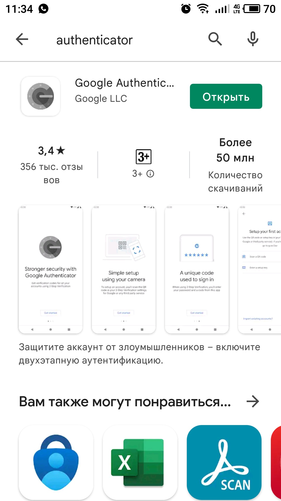

# **3.9. Элементы безопасности информационных систем**

# *1. Установть Bitwarden плагин для браузера и зарегистрироваться*
Установим плагин для Google Chrome


Зарегистрируемся на bitwarden.com


# *2. Установить Google authenticator на мобильный телефон и настроить вход в Bitwarden аккаунт через Google authenticator OTP.*
Устанавливаем Google authenticator на мобильный телефон:



Настроим вход в Bitwarden через двухфакторную аутентификацию


# *3. Установка apache2, генерация сертификата, HTTPS.*

Для выполнения данного пункта используем виртуальную машину.

Запустим сервер:

```
vagrant up
Bringing machine 'default' up with 'virtualbox' provider...
==> default: Importing base box 'bento/ubuntu-20.04'...
==> default: Matching MAC address for NAT networking...
==> default: Checking if box 'bento/ubuntu-20.04' version '202107.28.0' is up to date...
==> default: Setting the name of the VM: Lab39Files_default_1639125943327_92725
==> default: Clearing any previously set network interfaces...
==> default: Preparing network interfaces based on configuration...
    default: Adapter 1: nat
==> default: Forwarding ports...
    default: 22 (guest) => 2222 (host) (adapter 1)
==> default: Running 'pre-boot' VM customizations...
==> default: Booting VM...
==> default: Waiting for machine to boot. This may take a few minutes...
....
```
Обновим репозитории и установим HTTP сервер:

```
vagrant@vagrant:~$ sudo apt update
vagrant@vagrant:~$ sudo apt install apache2

```
Включим модуль ssl в HTTP сервере и перезапустим сервис:

```
vagrant@vagrant:~$ sudo a2enmod ssl
Considering dependency setenvif for ssl:
Module setenvif already enabled
Considering dependency mime for ssl:
Module mime already enabled
Considering dependency socache_shmcb for ssl:
Enabling module socache_shmcb.
Enabling module ssl.
See /usr/share/doc/apache2/README.Debian.gz on how to configure SSL and create self-signed certificates.
To activate the new configuration, you need to run:
  systemctl restart apache2
vagrant@vagrant:~$ sudo systemctl restart apache2
```

Сгенерируем закрытый ключ и самоподписанный сертификат

```
sudo openssl req -x509 -nodes -days 3650 -newkey rsa:2048 -keyout /etc/ssl/private/apache-selfsigned.key -out /etc/ssl/certs/apache-selfsigned.crt -subj "/C=RU/ST=St-Petersburg/L=St-Petersburg/O=Company Name/OU=Org/CN=localhost"
```

Создадим конфигурационный файл /etc/apache2/sites-available/localhost.conf и пропишем настройки:

```
<VirtualHost *:443>
ServerName localhost
DocumentRoot /var/www/localhost
SSLEngine on
SSLCertificateFile /etc/ssl/certs/apache-selfsigned.crt
SSLCertificateKeyFile /etc/ssl/private/apache-selfsigned.key
</VirtualHost>
```

Создадим каталог и тестовоую страницу:

```
sudo mkdir /var/www/localhost
sudo vi /var/www/localhost/index.html
<h1>HTTPS works!</h1>
```
Разрешим отображение нашего сайта, проверим конфигурацию на ошибки и перезапустим сервис:

```
vagrant@vagrant:~$ sudo a2ensite localhost
Enabling site localhost.
To activate the new configuration, you need to run:
  systemctl reload apache2

vagrant@vagrant:~$ sudo apache2ctl configtest
Syntax OK

sudo systemctl reload apache2
```

Добавим в конфигурацию Vagrant файла проброс портов:

```
config.vm.network "forwarded_port", guest: 443, host: 8080
```

И откроем страницу в браузере:


# *4. Проверка на TLS уязвимости*
Проверим на уязвимости созданный в пердыдущем пункте сайт:

```
./testssl.sh -U --sneaky https://localhost:8080

###########################################################
    testssl.sh       3.1dev from https://testssl.sh/dev/
    (2dce751 2021-12-09 17:03:57 -- )

      This program is free software. Distribution and
             modification under GPLv2 permitted.
      USAGE w/o ANY WARRANTY. USE IT AT YOUR OWN RISK!

       Please file bugs @ https://testssl.sh/bugs/

###########################################################

 Using "OpenSSL 1.0.2-chacha (1.0.2k-dev)" [~183 ciphers]
 on linuxvb:./bin/openssl.Linux.x86_64
 (built: "Jan 18 17:12:17 2019", platform: "linux-x86_64")


 Start 2021-12-10 13:46:04        -->> 127.0.0.1:8080 (localhost) <<--

 A record via:           /etc/hosts 
 rDNS (127.0.0.1):       --
 Service detected:       HTTP


 Testing vulnerabilities 

 Heartbleed (CVE-2014-0160)                not vulnerable (OK), no heartbeat extension
 CCS (CVE-2014-0224)                       not vulnerable (OK)
 Ticketbleed (CVE-2016-9244), experiment.  not vulnerable (OK)
 ROBOT                                     not vulnerable (OK)
 Secure Renegotiation (RFC 5746)           supported (OK)
 Secure Client-Initiated Renegotiation     not vulnerable (OK)
 CRIME, TLS (CVE-2012-4929)                not vulnerable (OK)
 BREACH (CVE-2013-3587)                    no gzip/deflate/compress/br HTTP compression (OK)  - only supplied "/" tested
 POODLE, SSL (CVE-2014-3566)               not vulnerable (OK)
 TLS_FALLBACK_SCSV (RFC 7507)              No fallback possible (OK), no protocol below TLS 1.2 offered
 SWEET32 (CVE-2016-2183, CVE-2016-6329)    not vulnerable (OK)
 FREAK (CVE-2015-0204)                     not vulnerable (OK)
 DROWN (CVE-2016-0800, CVE-2016-0703)      not vulnerable on this host and port (OK)
                                           make sure you don't use this certificate elsewhere with SSLv2 enabled services
                                           https://censys.io/ipv4?q=659D80F6B8C846B7054ED8B22FA1B5B47D470A0012A7AA502D65170F1750E7D6 could help you to find out
 LOGJAM (CVE-2015-4000), experimental      common prime with 2048 bits detected: RFC3526/Oakley Group 14 (2048 bits),
                                           but no DH EXPORT ciphers
 BEAST (CVE-2011-3389)                     not vulnerable (OK), no SSL3 or TLS1
 LUCKY13 (CVE-2013-0169), experimental     potentially VULNERABLE, uses cipher block chaining (CBC) ciphers with TLS. Check patches
 Winshock (CVE-2014-6321), experimental    not vulnerable (OK)
 RC4 (CVE-2013-2566, CVE-2015-2808)        no RC4 ciphers detected (OK)


 Done 2021-12-10 13:46:33 [  32s] -->> 127.0.0.1:8080 (localhost) <<--

```

И произвольный сайт в интернете:

```
./testssl.sh -U --sneaky https://ru.nec.com/

###########################################################
    testssl.sh       3.1dev from https://testssl.sh/dev/
    (2dce751 2021-12-09 17:03:57 -- )

      This program is free software. Distribution and
             modification under GPLv2 permitted.
      USAGE w/o ANY WARRANTY. USE IT AT YOUR OWN RISK!

       Please file bugs @ https://testssl.sh/bugs/

###########################################################

 Using "OpenSSL 1.0.2-chacha (1.0.2k-dev)" [~183 ciphers]
 on linuxvb:./bin/openssl.Linux.x86_64
 (built: "Jan 18 17:12:17 2019", platform: "linux-x86_64")


 Start 2021-12-10 13:56:50        -->> 23.52.20.85:443 (ru.nec.com) <<--

 rDNS (23.52.20.85):     e13694.b.akamaiedge.net.
 Service detected:       HTTP


 Testing vulnerabilities 

 Heartbleed (CVE-2014-0160)                not vulnerable (OK), no heartbeat extension
 CCS (CVE-2014-0224)                       not vulnerable (OK)
 Ticketbleed (CVE-2016-9244), experiment.  not vulnerable (OK)
 ROBOT                                     not vulnerable (OK)
 Secure Renegotiation (RFC 5746)           supported (OK)
 Secure Client-Initiated Renegotiation     VULNERABLE (NOT ok), DoS threat (6 attempts)
 CRIME, TLS (CVE-2012-4929)                not vulnerable (OK)
 BREACH (CVE-2013-3587)                    potentially NOT ok, "gzip" HTTP compression detected. - only supplied "/" tested
                                           Can be ignored for static pages or if no secrets in the page
 POODLE, SSL (CVE-2014-3566)               not vulnerable (OK)
 TLS_FALLBACK_SCSV (RFC 7507)              No fallback possible (OK), no protocol below TLS 1.2 offered
 SWEET32 (CVE-2016-2183, CVE-2016-6329)    not vulnerable (OK)
 FREAK (CVE-2015-0204)                     not vulnerable (OK)
 DROWN (CVE-2016-0800, CVE-2016-0703)      not vulnerable on this host and port (OK)
                                           make sure you don't use this certificate elsewhere with SSLv2 enabled services
                                           https://censys.io/ipv4?q=FCAF157138F0A134A1AA6BE2373C4A85E4A77B546715E19F99C1C649F08973C7 could help you to find out
 LOGJAM (CVE-2015-4000), experimental      not vulnerable (OK): no DH EXPORT ciphers, no DH key detected with <= TLS 1.2
 BEAST (CVE-2011-3389)                     not vulnerable (OK), no SSL3 or TLS1
 LUCKY13 (CVE-2013-0169), experimental     potentially VULNERABLE, uses cipher block chaining (CBC) ciphers with TLS. Check patches
 Winshock (CVE-2014-6321), experimental    not vulnerable (OK)
 RC4 (CVE-2013-2566, CVE-2015-2808)        no RC4 ciphers detected (OK)


 Done 2021-12-10 13:57:35 [  48s] -->> 23.52.20.85:443 (ru.nec.com) <<--

```

# *5. Ssh сервер*
Для проверки будем использовать ту же виртуальную машину. Подключаться по ssh будем через существующий проброс порт 21 виртульной машины на 2222 порт хоста.

Сгенерируем публичный и частный ключи:

```
ssh-keygen -f .ssh/virual
Generating public/private rsa key pair.
Enter passphrase (empty for no passphrase): 
Enter same passphrase again: 
Your identification has been saved in .ssh/virual
Your public key has been saved in .ssh/virual.pub
The key fingerprint is:
SHA256:kjMROUB+2vY6ZiSRbjFGUr7pl9ChAwL7YD6EjTBrEME s_kosenko@linuxvb
The key's randomart image is:
+---[RSA 3072]----+
|Oo o+...         |
|=E.o. o.         |
|B+ooo.+.         |
|=+ .*O +         |
| o.oB+O S        |
|  ..++.*         |
|   ..oo .        |
|     .+.         |
|     o..         |
+----[SHA256]-----+

```

Скопируем публичный ключ на сервер:

```
ssh-copy-id -i .ssh/virual.pub -p 2222 vagrant@localhost
/usr/bin/ssh-copy-id: INFO: Source of key(s) to be installed: ".ssh/virual.pub"
/usr/bin/ssh-copy-id: INFO: attempting to log in with the new key(s), to filter out any that are already installed
/usr/bin/ssh-copy-id: INFO: 1 key(s) remain to be installed -- if you are prompted now it is to install the new keys
vagrant@localhost's password: 

Number of key(s) added: 1

Now try logging into the machine, with:   "ssh -p '2222' 'vagrant@localhost'"
and check to make sure that only the key(s) you wanted were added.
```

Проверим подключение:

```
ssh -p 2222 vagrant@localhost
Welcome to Ubuntu 20.04.2 LTS (GNU/Linux 5.4.0-80-generic x86_64)

 * Documentation:  https://help.ubuntu.com
 * Management:     https://landscape.canonical.com
 * Support:        https://ubuntu.com/advantage

  System information as of Fri 10 Dec 2021 11:37:04 AM UTC

  System load:  0.0               Processes:             111
  Usage of /:   2.5% of 61.31GB   Users logged in:       1
  Memory usage: 7%                IPv4 address for eth0: 10.0.2.15
  Swap usage:   0%


This system is built by the Bento project by Chef Software
More information can be found at https://github.com/chef/bento
Last login: Fri Dec 10 11:22:43 2021 from 10.0.2.2
vagrant@vagrant:~$ 

```

# *5. Ssh сервер другое имя файла ключа*
Переименуем файлы ключей и проверим подключение ещё раз.

Теперь при подключени запрашивается пароль:

```
ssh -p 2222 vagrant@localhost
vagrant@localhost's password:
``` 

Укажем в команде путь к переименованному файлу ключа:

```
ssh -i .ssh/virtual -p 2222 vagrant@localhost
Welcome to Ubuntu 20.04.2 LTS (GNU/Linux 5.4.0-80-generic x86_64)

 * Documentation:  https://help.ubuntu.com
 * Management:     https://landscape.canonical.com
 * Support:        https://ubuntu.com/advantage

  System information as of Fri 10 Dec 2021 11:41:09 AM UTC

  System load:  0.0               Processes:             109
  Usage of /:   2.5% of 61.31GB   Users logged in:       1
  Memory usage: 7%                IPv4 address for eth0: 10.0.2.15
  Swap usage:   0%


This system is built by the Bento project by Chef Software
More information can be found at https://github.com/chef/bento
Last login: Fri Dec 10 11:37:04 2021 from 10.0.2.2
vagrant@vagrant:~$ 
```

Подключение успешно.

# *6. Дамп трафика и утилита tcpdump*

Соберём утилитой tcpdump 100 пакетов на нашей виртуальной машине:

```
vagrant@vagrant:~$ sudo tcpdump -c 100 -w /vagrant/dump.pcap -ieth0
tcpdump: listening on eth0, link-type EN10MB (Ethernet), capture size 262144 bytes
100 packets captured
116 packets received by filter
0 packets dropped by kernel
vagrant@vagrant:~$ 
```

Теперь можем смотреть и анализировать содержимое файла графической утилитой Wireshark:


