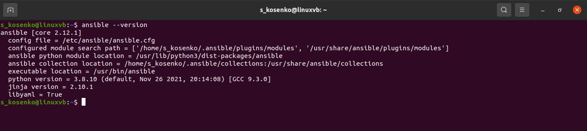

# **5.2. Применение принципов IaaC в работе с виртуальными машинами**

# *Задача 1*
IaaC ускоряет процесс создания и изменения инфраструктуры для разработки, тестирования и эксплуатации продукта. Устраняет несовпадение (дрейф) конфигурций на этапах разработки и эксплуатации. Оптимизирует каждый этап жизненного цикла доставки ПО, что повышает скорость и эффективность разработки.

Основополагающим принципом IaaC является идемпотентность - свойство объекта или операции, при повторном выполнении которой мы получаем результат идентичный предыдущему и всем последующим выполнениям. 

# *Задача 2*

Тот факт, что Ansible использует существующую SSH инфраструктуру, а не требует установки специального PKI-окружения, выгодно отличает его от других систем управления конфигурациями.

На мой взгляд, push метод работы систем конфигурации более надёжный, чем pull. При использовании pull метода появляется точка отказа в виде сервера, с которого клиенты должны забирать конфигурацию. В push методе существенным минусом является то, что для применения конфигурации на новые клиенты мы должны знать информацию об этих клиентах (имя, IP адрес), что в динамических средах зачастую бывает сложно. В pull методе достаточно агенту указать адрес сервера, который мы знаем всегда и агент сам применит конфигурацию.

# *Задача 3*

Установка VirtualBox 

```
apt-get update 
apt-get install virtualbox
```


Установка Vagrant

```
url -fsSL https://apt.releases.hashicorp.com/gpg | sudo apt-key add -
sudo apt-add-repository "deb [arch=amd64] https://apt.releases.hashicorp.com $(lsb_release -cs) main"
sudo apt-get update && sudo apt-get install vagrant
```


Установка Ansible

```
sudo apt install software-properties-common
sudo add-apt-repository --yes --update ppa:ansible/ansible
sudo apt update && sudo apt install ansible
```




# *Задача 4*


