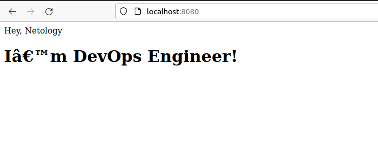

# **5.3. Введение. Экосистема. Архитектура. Жизненный цикл Docker контейнера**

# *Задача 1*

**1.1. Создайте свой fork образа**

```
vagrant@server1:~$ docker pull nginx:1.21.5-alpine
1.21.5-alpine: Pulling from library/nginx
59bf1c3509f3: Pull complete 
f3322597df46: Pull complete 
d09cf91cabdc: Pull complete 
3a97535ac2ef: Pull complete 
919ade35f869: Pull complete 
40e5d2fe5bcd: Pull complete 
Digest: sha256:eb05700fe7baa6890b74278e39b66b2ed1326831f9ec3ed4bdc6361a4ac2f333
Status: Downloaded newer image for nginx:1.21.5-alpine
docker.io/library/nginx:1.21.5-alpine

vagrant@server1:~$ docker images
REPOSITORY   TAG             IMAGE ID       CREATED       SIZE
nginx        1.21.5-alpine   cc44224bfe20   3 weeks ago   23.5MB
```
**1.2. Реализовать запуск веб-сервера в фоне с индекс-страницей**

Создадим файл index.html, содержащий код:
```
<html>
<head>
Hey, Netology
</head>
<body>
<h1>I’m DevOps Engineer!</h1>
</body>
</html>
```
И файл манифест следующего содержания:
```
FROM nginx:1.21.5-alpine
COPY index.html /usr/share/nginx/html/
```

Создадим образ для контейнера:

```
vagrant@server1:~$ docker build -t sergeyk78/nginx-cp:1.21.5-alpine .
Sending build context to Docker daemon  37.89kB
Step 1/2 : FROM nginx:1.21.5-alpine
 ---> cc44224bfe20
Step 2/2 : COPY index.html /usr/share/nginx/html/
 ---> 2638474085e4
Successfully built 2638474085e4
Successfully tagged sergeyk78/nginx-cp:1.21.5-alpine
vagrant@server1:~$ docker images
REPOSITORY           TAG             IMAGE ID       CREATED          SIZE
sergeyk78/nginx-cp   1.21.5-alpine   2638474085e4   29 minutes ago   23.5MB
nginx                1.21.5-alpine   cc44224bfe20   3 weeks ago      23.5MB
vagrant@server1:~$ 
```
Запустим контейнер:
```
vagrant@server1:~$ docker run --name test-page -p 80:80 -d sergeyk78/nginx-cp:1.21.5-alpine

vagrant@server1:~$ docker ps
CONTAINER ID   IMAGE                    COMMAND                  CREATED          STATUS         PORTS                               NAMES
eb9b8dedd207   sergeyk78/nginx-cp:1.21.5-alpine   "/docker-entrypoint.…"   10 minutes ago   Up 3 minutes   0.0.0.0:80->80/tcp, :::80->80/tcp   test-page

vagrant@server1:~$ curl localhost
<html>
<head>
Hey, Netology
</head>
<body>
<h1>I’m DevOps Engineer!</h1>
</body>
</html>
```

У нас порт 80 виртуальной машины проброшен на порт 8080 хостовой. Попробуем открыть страницу в браузере:



**1.3. Опубликуем созданный образ в репозитории**

```
vagrant@server1:~$ docker login -u sergeyk78
Password: 

Login Succeeded

vagrant@server1:~$ docker push sergeyk78/nginx-cp:1.21.5-alpine
The push refers to repository [docker.io/sergeyk78/nginx-cp]
7f38051e8671: Pushed 
419df8b60032: Mounted from library/nginx 
0e835d02c1b5: Mounted from library/nginx 
5ee3266a70bd: Mounted from library/nginx 
3f87f0a06073: Mounted from library/nginx 
1c9c1e42aafa: Mounted from library/nginx 
8d3ac3489996: Mounted from library/nginx 
1.21.5-alpine: digest: sha256:a00b98d50bd825afa061f3abb87fbeb7bf5d291cda4debb3dfcf58347d4815cd size: 1775
vagrant@server1:~$
```

Ссылка на репозиторий:
https://hub.docker.com/repository/docker/sergeyk78/nginx-cp


# *Задача 2*

- Высоконагруженное монолитное java веб-приложение;

Подходит использование Docker контейнеров. В данном случае у нас есть возможность при необходимости масштабировать ресурсы. Запуск приложения происходит быстрее.

- Nodejs веб-приложение;

Так же подходит использование Docker контейнеров. Удобно разворачивать новые версии, автоматизировать запуск и остановку дополнительных контейнеров в случае увеличения или уменьшения нагрузки. 

- Мобильное приложение c версиями для Android и iOS;

Подходит использование Docker контейнеров. Docker образ можно запускать на разных системах, не беспокоясь, что приложение не запустится, т.к. все зависимости и настройки находятся в образе.

- Шина данных на базе Apache Kafka;

Используем Docker контейнеры. Удобно разворачивать, легко добавлять сервера в кластер если нужно.

- Elasticsearch кластер для реализации логирования продуктивного веб-приложения - три ноды elasticsearch, два logstash и две ноды kibana;

Подходит использоавние Docker контейнеров. УДобство установки, возможность масштабирования.

- Мониторинг-стек на базе Prometheus и Grafana;

Подходит использование Docker. Удобно настроить экспортер, просто скопировать его на необходимые узлы и запустить.

- MongoDB, как основное хранилище данных для java-приложения;

Виртульный или физический сервер. Для тонкой настройки может потребоваться изменение параметров ядра.

- Gitlab сервер для реализации CI/CD процессов и приватный (закрытый) Docker Registry.

Виртуальный или физический сервер. 

Нет большого опыта общения с приведёнными выше инструментами, поэтому ответы скорее предположения, чем утверждения.

# *Задача 3*

**3.1. Запустите первый контейнер из образа centos c любым тэгом в фоновом режиме, подключив папку /data из текущей рабочей директории на хостовой машине в /data контейнера**
```
vagrant@server1:~$ docker run -v /data:/data -it --name centos-docker -d centos:7.9.2009
```

**3.2. Запустите второй контейнер из образа debian в фоновом режиме, подключив папку /data из текущей рабочей директории на хостовой машине в /data контейнера**
```
vagrant@server1:~$ docker run -v /data:/data -it --name debian-docker -d debian:9.13
vagrant@server1:~$ docker ps
CONTAINER ID   IMAGE             COMMAND       CREATED              STATUS              PORTS     NAMES
fbafb86669e8   centos:7.9.2009   "/bin/bash"   5 seconds ago        Up 4 seconds                  centos-docker
0908f3cec16b   debian:9.13       "bash"        About a minute ago   Up About a minute             debian-docker
```

**3.3. Подключитесь к первому контейнеру с помощью docker exec и создайте текстовый файл любого содержания в /data**
```
vagrant@server1:~$ docker exec -it centos-docker bash
[root@4ec0893b96c1 /]#
[root@4ec0893b96c1 /]# echo "One string from centos-docker" > /data/file-centos-docker.txt
```

**3.4. Добавьте еще один файл в папку /data на хостовой машине**
```
vagrant@server1:~$ sudo bash -c "echo 'One string from host-machine' > /data/file-host-machine.txt"
```

**3.5. Подключитесь во второй контейнер и отобразите листинг и содержание файлов в /data контейнера**
```
vagrant@server1:~$ docker exec -it debian-docker bash
root@0908f3cec16b:/#
root@0908f3cec16b:/# ls /data
file-centos-docker.txt	file-host-machine.txt
root@0908f3cec16b:/# more /data/*
::::::::::::::
/data/file-centos-docker.txt
::::::::::::::
One string from centos-docker
::::::::::::::
/data/file-host-machine.txt
::::::::::::::
One string from host-machine
root@0908f3cec16b:/#
```

# *Задача 4*

https://hub.docker.com/repository/docker/sergeyk78/ansible

