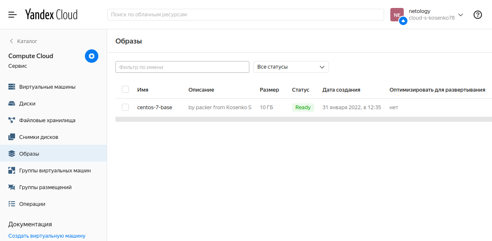
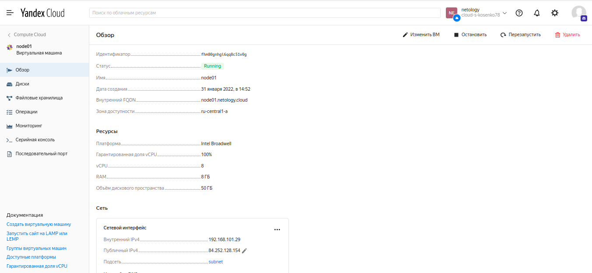
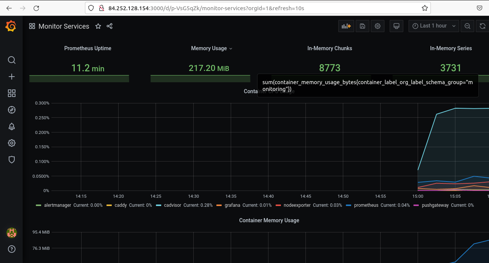
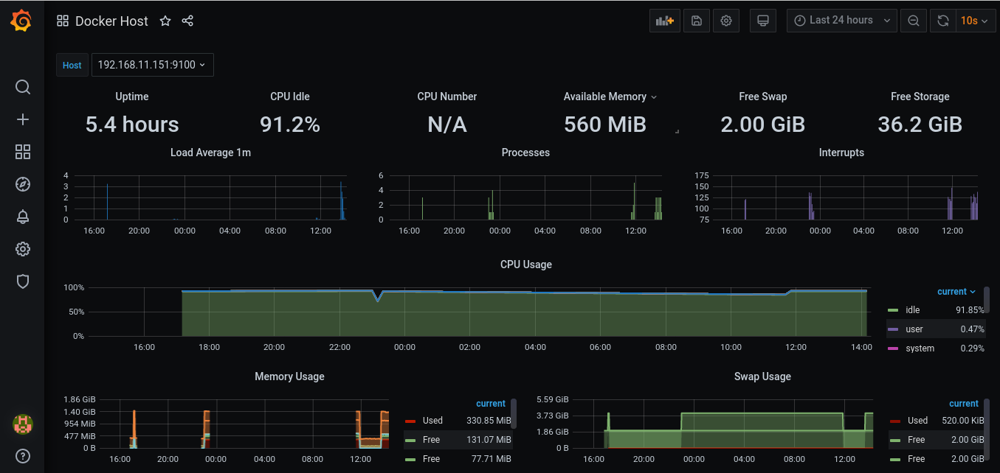
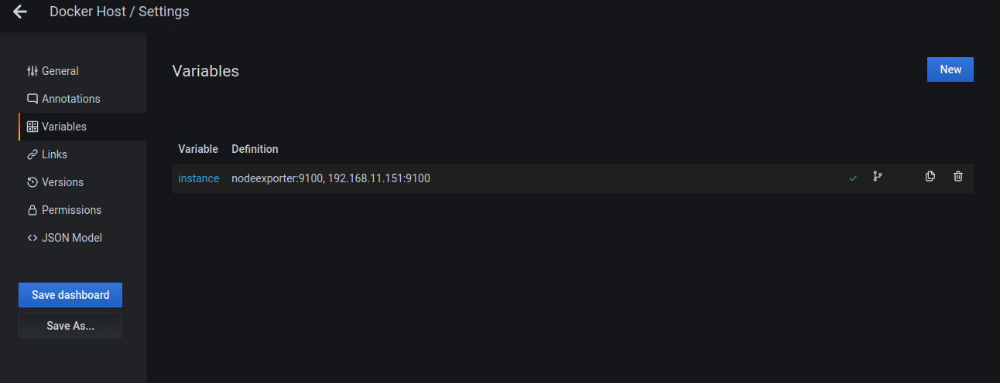
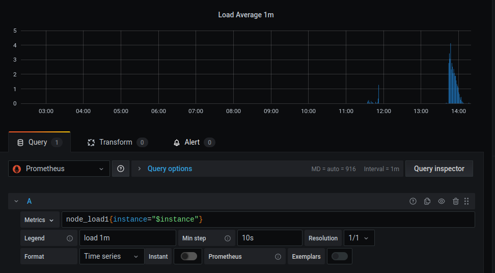

# **5.4. Оркестрация группой Docker контейнеров на примере Docker Compose**

# *Задача 1*

# *Задача 2*

# *Задача 3*

# *Задача 4*

Совсем не уверен в правильности решения, к тому же так и не удалось победить показатель "CPU Number", но другой идеи не возникло:

- добавить переменную в дашборд:

- изменить в панелях дашборда запросы к Prometheus, добавив проверку источника метрики {instance="$instance"}:

Буду рад, если в комментарии к ДЗ натолкнёте на правильное решение.