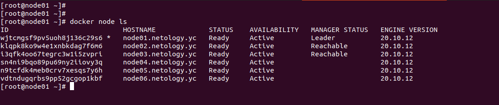
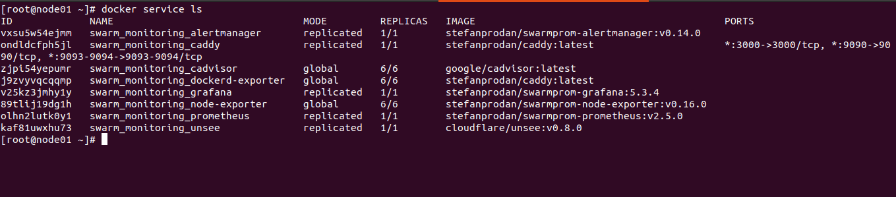
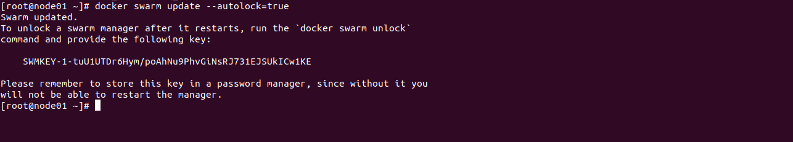

# **5.5. Оркестрация кластером Docker контейнеров на примере Docker Swarm**

# *Задача 1*

- Режимы работы сервисов replication и global отличаются тем, что сервисы в режиме global запускаются на каждом узле кластера. Replication только на стольких узлах, сколько указано в настройках.
- В Docker Swarm кластере используется алгоритм Raft для выбора лидера.
- Overlay Network - это сети, которые доступны на всех узлах кластера Docker Swarm. Основаны на использовании технологии VXLAN.

# *Задача 2*

# *Задача 3*

# *Задача 4*

Данная команда нужна для усиления безопасности. При установке данной опции, лидер менеджер Docker Swarm кластера потребует разблокировки ключём, после рестарта сервиса docker.