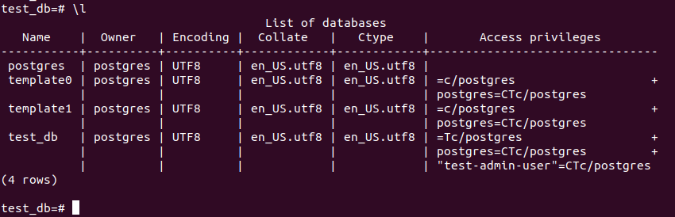
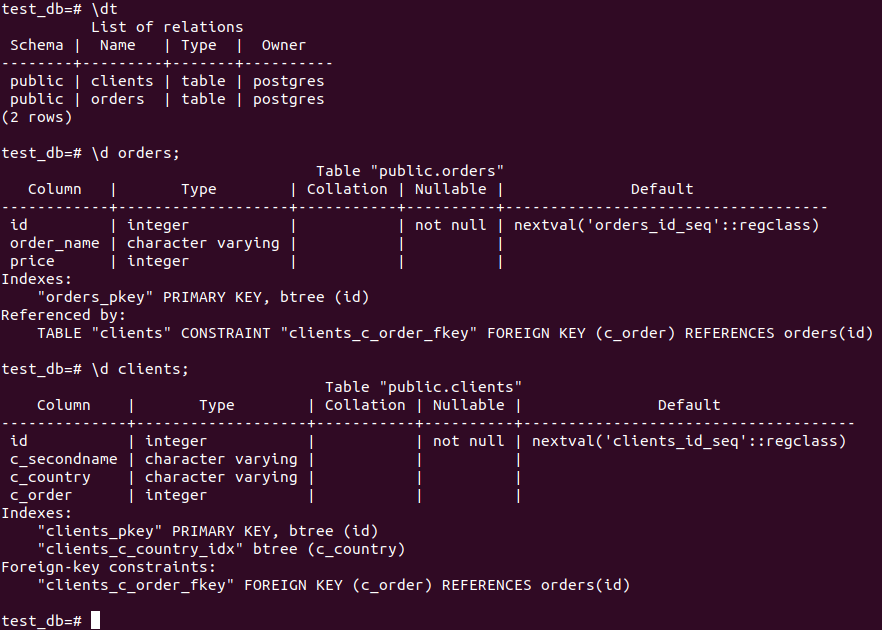
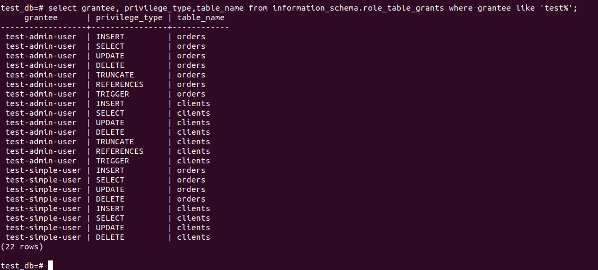
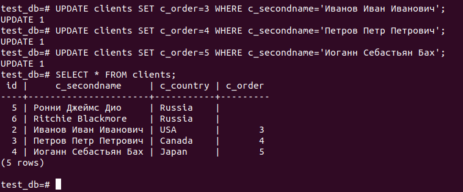
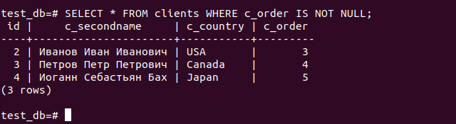
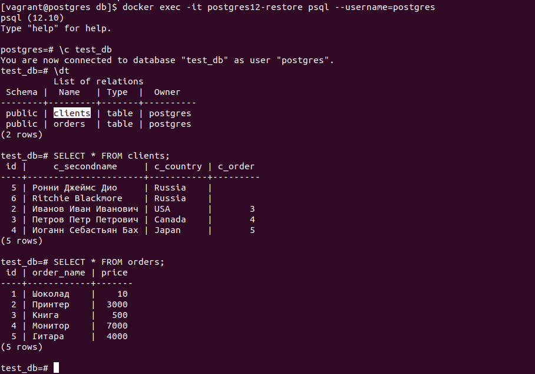

# **6.2. SQL**

# *Задача 1*

Файл docker-compose.yaml:

```
version: '2.1'

volumes:
    postgres_data: {}
    postgres_backup: {}

services:

  postgres12:
    image: postgres:12-alpine3.15
    container_name: postgres12
    volumes:
      - postgres_data:/var/lib/postgresql/data
      - postgres_backup:/var/lib/postgresql/backup
    restart: always
    environment:
      - POSTGRES_PASSWORD=mysecretpassword
    ports:
      - "5432:5432"
``` 

Подключение к консоли:
```
docker exec -it postgres12 psql --username=postgres
```

# *Задача 2*

- CREATE DATABASE test_db;

  CREATE USER "test-admin-user";

- CREATE TABLE orders (id serial PRIMARY KEY, order_name VARCHAR, price INT);

  CREATE TABLE clients (id serial PRIMARY KEY, c_secondname VARCHAR, c_country VARCHAR, c_order INT REFERENCES orders);

  CREATE INDEX ON clients(c_country);

- GRANT ALL ON ALL TABLES IN SCHEMA public TO "test-admin-user";

- CREATE USER "test-simple-user";

- GRANT SELECT,INSERT,UPDATE,DELETE ON ALL TABLES IN SCHEMA public TO "test-simple-user";







# *Задача 3*

Наполнить таблицы данными: 

```
test_db=# INSERT INTO orders(order_name,price) VALUES ('Шоколад',10);
INSERT 0 1
test_db=# INSERT INTO orders(order_name,price) VALUES ('Принтер',3000);
INSERT 0 1
test_db=# INSERT INTO orders(order_name,price) VALUES ('Книга',500);
INSERT 0 1
test_db=# INSERT INTO orders(order_name,price) VALUES ('Монитор',7000);
INSERT 0 1
test_db=# INSERT INTO orders(order_name,price) VALUES ('Гитара',4000);
INSERT 0 1
```

```
test_db=# INSERT INTO clients(c_secondname,c_country) VALUES ('Иванов Иван Иванович','USA');
INSERT 0 1
test_db=# INSERT INTO clients(c_secondname,c_country) VALUES ('Петров Петр Петрович','Canada');
INSERT 0 1
test_db=# INSERT INTO clients(c_secondname,c_country) VALUES ('Иоганн Себастьян Бах','Japan');
INSERT 0 1
test_db=# INSERT INTO clients(c_secondname,c_country) VALUES ('Ронни Джеймс
Дио','Russia');
INSERT 0 1
test_db=# INSERT INTO clients(c_secondname,c_country) VALUES ('Ritchie Blackmore','Russia');
INSERT 0 1
```

# *Задача 4*

SQL-запросы для выполнения обновления записей:



SQL-запрос для выдачи всех пользователей, которые совершили заказ:



# *Задача 5*

```
test_db=# EXPLAIN (VERBOSE) SELECT * FROM clients WHERE c_order IS NOT NULL;
                            QUERY PLAN                            
------------------------------------------------------------------
 Seq Scan on public.clients  (cost=0.00..18.10 rows=806 width=72)
   Output: id, c_secondname, c_country, c_order
   Filter: (clients.c_order IS NOT NULL)
(3 rows)

test_db=# 
```

В выводе указаны подробности выполнения запроса, какие столбцы должны быть выведены, какой поиск и фильтр применены.

# *Задача 6*

```
[vagrant@postgres db]$ docker exec -it postgres12 /bin/bash -c 'pg_dump --username=postgres test_db > /var/lib/postgresql/backup/test_db.dmp'
```

```
[vagrant@postgres db] docker run --name postgres12-restore -v /var/lib/docker/volumes/db_postgres_backup/_data:/var/lib/postgresql/backup -e POSTGRES_PASSWORD=mysecretpassword -d postgres:12-alpine3.15
```

```
[vagrant@postgres db]$ docker exec -it postgres12-restore psql --username=postgres
psql (12.10)
Type "help" for help.

postgres=# create database test_db;
```

```
[vagrant@postgres db]$ docker exec -it postgres12-restore /bin/bash -c 'psql --username=postgres test_db < /var/lib/postgresql/backup/test_db.dmp'
```

