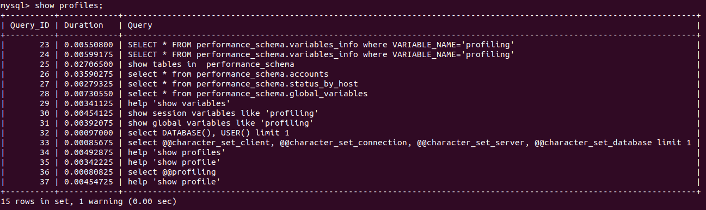
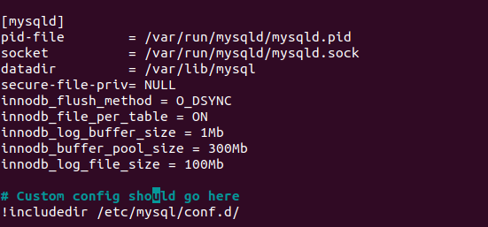

# **6.3. MySQL**

# *Задача 1*

Файл docker-compose.yaml:

```
version: '2.1'

volumes:
    mysql_data: {}

services:

  mysql:
    image: mysql:8.0.28
    container_name: mysql
    volumes:
      - ./mysql_data:/var/lib/mysql
    restart: always
    environment:
      - MYSQL_ROOT_PASSWORD=mysecretpassword
    ports:
      - "3306:3306"
``` 

Создадим базу и восстановим её из бэкапа:

```
[vagrant@mysql db]$ docker exec -i mysql sh -c 'mysql -uroot -p"$MYSQL_ROOT_PASSWORD" -e"CREATE DATABASE test_db"'
[vagrant@mysql db]$ docker exec -i mysql sh -c 'mysql -uroot -p"$MYSQL_ROOT_PASSWORD" test_db' < ./test_dump.sql

```

Подключение к консоли:
```
[vagrant@mysql db]$ docker exec -it mysql sh -c 'mysql -uroot -p"$MYSQL_ROOT_PASSWORD"'
mysql: [Warning] Using a password on the command line interface can be insecure. 
Welcome to the MySQL monitor.  Commands end with ; or \g.
Your MySQL connection id is 12
Server version: 8.0.28 MySQL Community Server - GPL

Copyright (c) 2000, 2022, Oracle and/or its affiliates.

Oracle is a registered trademark of Oracle Corporation and/or its
affiliates. Other names may be trademarks of their respective
owners.

Type 'help;' or '\h' for help. Type '\c' to clear the current input statement.

mysql> 
```

Для получения статуса БД можно использовать команду status (\s):

```
mysql> \s
--------------
mysql  Ver 8.0.28 for Linux on x86_64 (MySQL Community Server - GPL)

Connection id:		35
Current database:	
Current user:		root@localhost
SSL:			Not in use
Current pager:		stdout
Using outfile:		''
Using delimiter:	;
Server version:		8.0.28 MySQL Community Server - GPL
Protocol version:	10
Connection:		Localhost via UNIX socket
Server characterset:	utf8mb4
Db     characterset:	utf8mb4
Client characterset:	latin1
Conn.  characterset:	latin1
UNIX socket:		/var/run/mysqld/mysqld.sock
Binary data as:		Hexadecimal
Uptime:			58 min 41 sec

Threads: 2  Questions: 156  Slow queries: 0  Opens: 274  Flush tables: 3  Open tables: 190  Queries per second avg: 0.044
--------------

mysql> 
```

Список таблиц восстановленной БД:

```
mysql> USE test_db;
Reading table information for completion of table and column names
You can turn off this feature to get a quicker startup with -A

Database changed
mysql> SHOW TABLES;
+-------------------+
| Tables_in_test_db |
+-------------------+
| orders            |
+-------------------+
1 row in set (0.00 sec)

mysql>
```

Количество записей со значением поля price > 300:

```
mysql> SELECT COUNT(*) FROM orders WHERE price > 300;
+----------+
| COUNT(*) |
+----------+
|        1 |
+----------+
1 row in set (0.00 sec)

mysql>
```

# *Задача 2*

Создадим пользователя с указанными в задаче параметрами:

```
mysql> CREATE USER 'test';
Query OK, 0 rows affected (0.01 sec)

mysql> ALTER USER 'test'
    -> IDENTIFIED WITH mysql_native_password BY 'test-pass'
    -> WITH MAX_CONNECTIONS_PER_HOUR 100
    -> PASSWORD EXPIRE INTERVAL 180 DAY FAILED_LOGIN_ATTEMPTS 3
    -> ATTRIBUTE '{"SecondName": "Pretty", "FirstName": "James"}';
Query OK, 0 rows affected (0.00 sec)

mysql>
```

Предоставим пользователю test привелегии на операции SELECT базы test_db:

```
mysql> GRANT SELECT ON test_db.* TO 'test';
mysql> show grants for test;
+-------------------------------------------+
| Grants for test@%                         |
+-------------------------------------------+
| GRANT USAGE ON *.* TO `test`@`%`          |
| GRANT SELECT ON `test_db`.* TO `test`@`%` |
+-------------------------------------------+
2 rows in set (0.00 sec)
```

```
mysql> SELECT * FROM INFORMATION_SCHEMA.USER_ATTRIBUTES;
+------------------+-----------+------------------------------------------------+
| USER             | HOST      | ATTRIBUTE                                      |
+------------------+-----------+------------------------------------------------+
| root             | %         | NULL                                           |
| test             | %         | {"FirstName": "James", "SecondName": "Pretty"} |
| mysql.infoschema | localhost | NULL                                           |
| mysql.session    | localhost | NULL                                           |
| mysql.sys        | localhost | NULL                                           |
| root             | localhost | NULL                                           |
+------------------+-----------+------------------------------------------------+
6 rows in set (0.01 sec)

mysql> 
```

# *Задача 3*

SHOW PROFILE и SHOW PROFILES отображают информацию об использовании ресурсов при выполнении запросов в текущей сессии:



В таблице БД test_db используется InnoDB Engine. Эта информация была получена из запроса ниже:

```
mysql> SELECT TABLE_NAME, ENGINE FROM information_schema.TABLES where TABLE_SCHEMA = 'test_db';
+------------+--------+
| TABLE_NAME | ENGINE |
+------------+--------+
| orders     | InnoDB |
+------------+--------+
1 row in set (0.00 sec)

mysql> 
```

Запросы на изменение engine для таблицы orders и время их выполнения:

```
mysql> show profiles;
+----------+------------+---------------------------------------------------------------------------------------------------------------------+
| Query_ID | Duration   | Query                                                                                                               |
+----------+------------+---------------------------------------------------------------------------------------------------------------------+
|       57 | 0.06297325 | ALTER TABLE orders ENGINE = 'MyISAM'                                                                                |
|       58 | 0.00415225 | SELECT TABLE_NAME, ENGINE FROM information_schema.TABLES where TABLE_SCHEMA = 'test_db'                             |
|       59 | 0.06487150 | ALTER TABLE orders ENGINE = InnoDB                                                                                  |
|       60 | 0.00402175 | SELECT TABLE_NAME, ENGINE FROM information_schema.TABLES where TABLE_SCHEMA = 'test_db'                             |
+----------+------------+---------------------------------------------------------------------------------------------------------------------+
4 rows in set, 1 warning (0.00 sec)

mysql> 
```

# *Задача 4*

```
vagrant@mysql db]$ docker stats --no-stream mysql 
CONTAINER ID   NAME      CPU %     MEM USAGE / LIMIT   MEM %     NET I/O          BLOCK I/O        PIDS
ae4451fd84ff   mysql     0.54%     384.9MiB / 991MiB   38.84%    16.5MB / 306kB   114MB / 52.5MB   38
[vagrant@mysql db]$ 
```

Для соответствия ТЗ внесены изменения в файл my.cnf:


