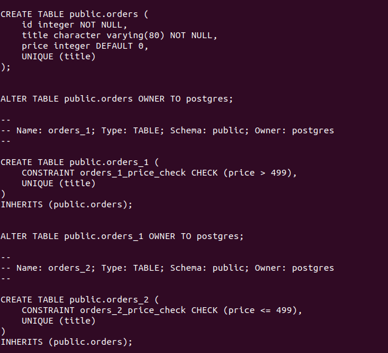

# **6.4. PostgreSQL**

# *Задача 1*

Файл docker-compose.yaml:

```
version: '3.1'

volumes:
    postgres_data: {}

services:

  postgres:
    image: postgres:13.6
    container_name: postgres
    volumes:
      - ./postgres_data:/var/lib/postgresql/data
    restart: always
    environment:
      - POSTGRES_PASSWORD=mysecretpassword
    ports:
      - "5432:5432"
``` 

Подключение к консоли:

```
[vagrant@postgres db]$ docker exec -it postgres psql -U postgres
```

Управляющие команды для:
- вывода списка БД: \l
- подключения к БД: \c test_database
- вывода списка таблиц: \dt
- вывода описания содержимого таблиц: \dt+
- выхода из psql: \q

# *Задача 2*

Создадим БД test_database:
- postgres=# CREATE DATABASE test_database;

Восстановим бэкап БД в test_database:
- [vagrant@postgres db]$ docker exec -i postgres psql -U postgres test_database < ./test_dump.sql

Подключимся к восстановленной БД и проведем операцию ANALYZE:
```  
  postgres=# \c test_database
  test_database=# ANALYZE;
```

Используя таблицу pg_stats, найдем столбец таблицы orders с наибольшим средним значением размера элементов в байтах:

```
test_database=# SELECT attname AS "Имя столбца", avg_width AS "Среднее" FROM pg_stats WHERE tablename='orders' AND avg_width=(SELECT MAX(avg_width) FROM pg_stats WHERE tablename='orders');
 Имя столбца | Среднее 
-------------+---------
 title       |      16
(1 row)

```

# *Задача 3*

SQL-транзакция для шардирования таблицы orders:

```
test_database=# BEGIN;
BEGIN
test_database=*# CREATE TABLE orders_1 ( CHECK (price>499)) INHERITS (orders);
CREATE TABLE
test_database=*# CREATE TABLE orders_2 ( CHECK (price<=499)) INHERITS (orders);CREATE TABLE
test_database=*# CREATE RULE orders_insert_to_1 AS ON INSERT TO orders WHERE (price>499) DO INSTEAD INSERT INTO orders_1 VALUES (NEW.*);
CREATE RULE
test_database=*# CREATE RULE orders_insert_to_2 AS ON INSERT TO orders WHERE (price<=499) DO INSTEAD INSERT INTO orders_2 VALUES (NEW.*);
CREATE RULE
test_database=*# COMMIT;
COMMIT
test_database=# \dt
          List of relations
 Schema |   Name   | Type  |  Owner   
--------+----------+-------+----------
 public | orders   | table | postgres
 public | orders_1 | table | postgres
 public | orders_2 | table | postgres
(3 rows)
```

Проверим распределение данных по таблицам:

```
test_database=# INSERT INTO orders (title,price) VALUES ('Less than 499', 350);
INSERT 0 0
test_database=# INSERT INTO orders (title,price) VALUES ('More than 499', 600);
INSERT 0 0

test_database=# SELECT * FROM orders;
 id |        title         | price 
----+----------------------+-------
  1 | War and peace        |   100
  2 | My little database   |   500
  3 | Adventure psql time  |   300
  4 | Server gravity falls |   300
  5 | Log gossips          |   123
  6 | WAL never lies       |   900
  7 | Me and my bash-pet   |   499
  8 | Dbiezdmin            |   501
 10 | More than 499        |   600
  9 | Less than 499        |   350
(10 rows)

test_database=# SELECT * FROM orders_1;
 id |     title     | price 
----+---------------+-------
 10 | More than 499 |   600
(1 row)

test_database=# SELECT * FROM orders_2;
 id |     title     | price 
----+---------------+-------
  9 | Less than 499 |   350
(1 row)

test_database=# 
```

Можно ли было изначально исключить "ручное" разбиение при проектировании таблицы orders?

- Да, можно было.

# *Задача 4*

Создадим бэкап БД test_database с помощью утилиты pg_dump:

```
[vagrant@postgres db]$ docker exec -it postgres pg_dump -U postgres test_database > ./test_db_bak.sql
```

Добавить уникальность значения столбца title для таблиц test_database можно :




