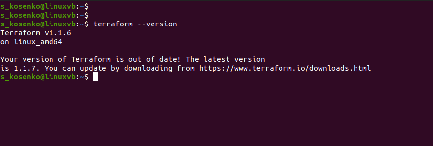
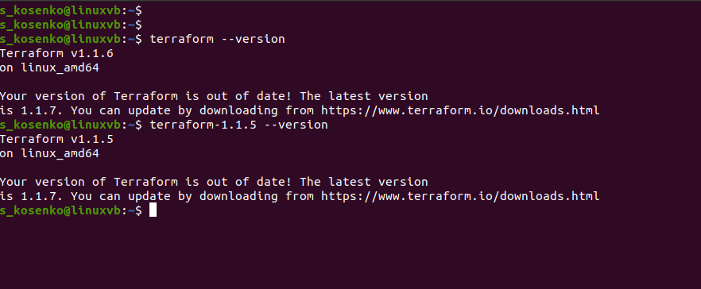

# **7.1. Инфраструктура как код**

# *Задача 1*

1.1. Ответы на четыре вопроса представленных в разделе "Легенда":

    1.1.1. Какой тип инфраструктуры будем использовать для этого проекта: изменяемый или не изменяемый?

    Поскольку уже известно, что техническое задание еще не четкое, предполагаются частые изменения, будем использовать изменяемый тип инфраструктуры.

    1.1.2. Будет ли центральный сервер для управления инфраструктурой?

    Для управления инфраструктурой будем использовать Ansible и Terraform, они не требуют центрального сервера.

    1.1.3. Будут ли агенты на серверах?

    Нет, используемые инструменты не тербуют утановки агентов.

    1.1.4. Будут ли использованы средства для управления конфигурацией или инициализации ресурсов?

    Будет использовано и то и то. Ansible - средство управления конфигурацией, Terraform - средство инициализации ресурсов.

1.2  Какие инструменты из уже используемых вы хотели бы использовать для нового проекта?

    1.2.1 Terraform + Packer
    1.2.2 Ansible
    1.2.3 Docker + Kubernetes
    1.2.4 Teamcity

1.3 Хотите ли рассмотреть возможность внедрения новых инструментов для этого проекта?

    Пока нет. Возможно, после получения подробностей о проекте, появится необходимость в дополнительных инструментах. 

# *Задача 2*

```
curl -fsSL https://apt.releases.hashicorp.com/gpg | sudo apt-key add -
sudo apt-add-repository "deb [arch=amd64] https://apt.releases.hashicorp.com $(lsb_release -cs) main"
sudo apt-get update && sudo apt-get install terraform
```



# *Задача 3*

