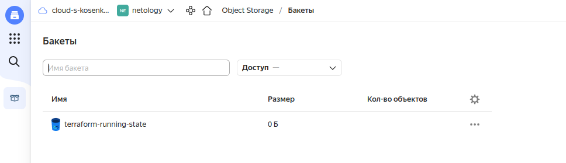

# **7.3. Основы и принцип работы Терраформ**

# *Задача 1. Создадим бэкэнд в S3*

1. Создадим статический ключ доступа для сервисной учётной записи. Этот ключ понадобится для подключения S3 бакет.

```
yc iam service-account list
+----------------------+-------------+
|          ID          |    NAME     |
+----------------------+-------------+
| aje4h0j2i352da28q9k7 | terra-robot |
+----------------------+-------------+

yc iam access-key create --service-account-name terra-robot
access_key:
  id: <value>
  service_account_id: <value>
  created_at: "2022-07-20T09:00:55.123212426Z"
  key_id: <value>
secret: <value>
```

Прежде чем сохранить состояние terraform в бэкэнд нужно создать S3 бакет. Создавать его будем тем же terraform. Для этого создадим ещё один конфигурационный файл в папке 's3-terraform':

```
terraform {
  required_providers {
    yandex = {
      source = "yandex-cloud/yandex"
    }
  }
  required_version = ">= 0.13"
}

provider "yandex" {
  service_account_key_file = "key.json"
  cloud_id  = "b1gl404splab9eas7u6l"
  folder_id = "b1g8t7bb3jnhfrkoa6uk"
  zone      = "ru-central1-a"
}

resource "yandex_storage_bucket" "tf-state" {
  bucket = "terraform-running-state"
}
```

Статический ключ укажем в переменных окружения:

export YC_STORAGE_ACCESS_KEY=<key_id>
export YC_STORAGE_SECRET_KEY=<secret>

Создадим S3 бакет:

```
terraform plan

Terraform used the selected providers to generate the following execution plan. Resource actions are indicated with the following symbols:
  + create

Terraform will perform the following actions:

  # yandex_storage_bucket.tf-state will be created
  + resource "yandex_storage_bucket" "tf-state" {
      + acl                   = "private"
      + bucket                = "terraform-running-state"
      + bucket_domain_name    = (known after apply)
      + default_storage_class = (known after apply)
      + folder_id             = (known after apply)
      + force_destroy         = false
      + id                    = (known after apply)
      + website_domain        = (known after apply)
      + website_endpoint      = (known after apply)

      + anonymous_access_flags {
          + list = (known after apply)
          + read = (known after apply)
        }

      + versioning {
          + enabled = (known after apply)
        }
    }

Plan: 1 to add, 0 to change, 0 to destroy.

─────────────────────────────────────────────────────────────────────────────────────────────────────────────────────────────────────────────────────

Note: You didn't use the -out option to save this plan, so Terraform can't guarantee to take exactly these actions if you run "terraform apply" now.

terraform apply -auto-approve

Terraform used the selected providers to generate the following execution plan. Resource actions are indicated with the following symbols:
  + create

Terraform will perform the following actions:

  # yandex_storage_bucket.tf-state will be created
  + resource "yandex_storage_bucket" "tf-state" {
      + acl                   = "private"
      + bucket                = "terraform-running-state"
      + bucket_domain_name    = (known after apply)
      + default_storage_class = (known after apply)
      + folder_id             = (known after apply)
      + force_destroy         = false
      + id                    = (known after apply)
      + website_domain        = (known after apply)
      + website_endpoint      = (known after apply)

      + anonymous_access_flags {
          + list = (known after apply)
          + read = (known after apply)
        }

      + versioning {
          + enabled = (known after apply)
        }
    }

Plan: 1 to add, 0 to change, 0 to destroy.
yandex_storage_bucket.tf-state: Creating...
yandex_storage_bucket.tf-state: Still creating... [10s elapsed]
yandex_storage_bucket.tf-state: Still creating... [20s elapsed]
yandex_storage_bucket.tf-state: Still creating... [30s elapsed]
yandex_storage_bucket.tf-state: Still creating... [40s elapsed]
yandex_storage_bucket.tf-state: Still creating... [50s elapsed]
yandex_storage_bucket.tf-state: Still creating... [1m0s elapsed]
yandex_storage_bucket.tf-state: Creation complete after 1m2s [id=terraform-running-state]

Apply complete! Resources: 1 added, 0 changed, 0 destroyed.

```



2. Теперь можно добавить бэкэнд в основную конфигурацию:

```
backend "s3" {
    endpoint   = "storage.yandexcloud.net"
    bucket     = "terraform-running-state"
    region     = "ru-central1"
    key        = "s3/terraform.tfstate"

    skip_region_validation      = true
    skip_credentials_validation = true
  }
```


# *Задача 2. Инициализируем проект и создаем воркспейсы.*


1. Выполните terraform init:

Статичный ключ бэкэнда укажем при инициализации terraform:

```
terraform init -backend-config="access_key=<key_id>" -backend-config="secret_key=<secret>"
```

2. Создайте два воркспейса stage и prod:

```
terraform workspace new stage
Created and switched to workspace "stage"!

You're now on a new, empty workspace. Workspaces isolate their state,
so if you run "terraform plan" Terraform will not see any existing state
for this configuration.
```

```
terraform workspace new prod
Created and switched to workspace "prod"!

You're now on a new, empty workspace. Workspaces isolate their state,
so if you run "terraform plan" Terraform will not see any existing state
for this configuration.
```

3. Добавьте зависимость типа инстанса от вокспейса:

Добавим в файл main.tf конфигурацию:
```
...

locals {
  comp_instance_type_map = {
    stage = "standard-v1"
    prod = "standard-v2"
  }
}

resource "yandex_compute_instance" "nodes" {
  name        = "${terraform.workspace}-node"
  platform_id = local.comp_instance_type_map[terraform.workspace]

  resources {
    cores  = 2
    memory = 4
  }

  boot_disk {
    initialize_params {
      image_id = "${yandex_compute_image.test-image.id}"
    }
  }

  network_interface {
    subnet_id = "${yandex_vpc_subnet.subnet.id}"
  }
}
...
```

Проверим:

```
terraform plan
...
# yandex_compute_instance.nodes will be created
  + resource "yandex_compute_instance" "nodes" {
      + created_at                = (known after apply)
      + folder_id                 = (known after apply)
      + fqdn                      = (known after apply)
      + hostname                  = (known after apply)
      + id                        = (known after apply)
      + name                      = "prod-node"
      + network_acceleration_type = "standard"
      + platform_id               = "standard-v2"
      + service_account_id        = (known after apply)
      + status                    = (known after apply)
      + zone                      = (known after apply)
...
```

Переключимся в другой workspace:

```
terraform workspace select stage
Switched to workspace "stage".
```

Проверим:

```
...
# yandex_compute_instance.nodes will be created
  + resource "yandex_compute_instance" "nodes" {
      + created_at                = (known after apply)
      + folder_id                 = (known after apply)
      + fqdn                      = (known after apply)
      + hostname                  = (known after apply)
      + id                        = (known after apply)
      + name                      = "stage-node"
      + network_acceleration_type = "standard"
      + platform_id               = "standard-v1"
      + service_account_id        = (known after apply)
      + status                    = (known after apply)
      + zone                      = (known after apply)
...
```

4. Добавим count. Для stage должен создаться один экземпляр, а для prod два.

Изменим конфигурацию в файле main.tf:

```
...
locals {
  comp_instance_type_map = {
    stage = "standard-v1"
    prod = "standard-v2"
  }

  instance_count_map = {
    stage = 1
    prod = 2
  }
}

resource "yandex_compute_instance" "nodes" {
  name        = "${terraform.workspace}-node-${count.index}"
  platform_id = local.comp_instance_type_map[terraform.workspace]
  count = local.instance_count_map[terraform.workspace]

  resources {
    cores  = 2
    memory = 4
  }
...
```
Проверим:

```
...
# yandex_compute_instance.nodes[0] will be created
  + resource "yandex_compute_instance" "nodes" {
      + created_at                = (known after apply)
      + folder_id                 = (known after apply)
      + fqdn                      = (known after apply)
      + hostname                  = (known after apply)
      + id                        = (known after apply)
      + name                      = "stage-node-0"
      + network_acceleration_type = "standard"
      + platform_id               = "standard-v1"
      + service_account_id        = (known after apply)
      + status                    = (known after apply)
      + zone                      = (known after apply)
...
```
Переключимся в другой workspace:

```
terraform workspace select prod
Switched to workspace "prod".
```

Проверим:

```
...
 # yandex_compute_instance.nodes[0] will be created
  + resource "yandex_compute_instance" "nodes" {
      + created_at                = (known after apply)
      + folder_id                 = (known after apply)
      + fqdn                      = (known after apply)
      + hostname                  = (known after apply)
      + id                        = (known after apply)
      + name                      = "prod-node-0"
      + network_acceleration_type = "standard"
      + platform_id               = "standard-v2"
      + service_account_id        = (known after apply)
      + status                    = (known after apply)
      + zone                      = (known after apply)

      + boot_disk {
          + auto_delete = true
          + device_name = (known after apply)
          + disk_id     = (known after apply)
          + mode        = (known after apply)

          + initialize_params {
              + block_size  = (known after apply)
              + description = (known after apply)
              + image_id    = (known after apply)
              + name        = (known after apply)
              + size        = (known after apply)
              + snapshot_id = (known after apply)
              + type        = "network-hdd"
            }
        }

      + network_interface {
          + index              = (known after apply)
          + ip_address         = (known after apply)
          + ipv4               = true
          + ipv6               = (known after apply)
          + ipv6_address       = (known after apply)
          + mac_address        = (known after apply)
          + nat                = (known after apply)
          + nat_ip_address     = (known after apply)
          + nat_ip_version     = (known after apply)
          + security_group_ids = (known after apply)
          + subnet_id          = (known after apply)
        }

      + placement_policy {
          + host_affinity_rules = (known after apply)
          + placement_group_id  = (known after apply)
        }

      + resources {
          + core_fraction = 100
          + cores         = 2
          + memory        = 4
        }

      + scheduling_policy {
          + preemptible = (known after apply)
        }
    }

  # yandex_compute_instance.nodes[1] will be created
  + resource "yandex_compute_instance" "nodes" {
      + created_at                = (known after apply)
      + folder_id                 = (known after apply)
      + fqdn                      = (known after apply)
      + hostname                  = (known after apply)
      + id                        = (known after apply)
      + name                      = "prod-node-1"
      + network_acceleration_type = "standard"
      + platform_id               = "standard-v2"
      + service_account_id        = (known after apply)
      + status                    = (known after apply)
      + zone                      = (known after apply)

      + boot_disk {
          + auto_delete = true
          + device_name = (known after apply)
          + disk_id     = (known after apply)
          + mode        = (known after apply)

          + initialize_params {
              + block_size  = (known after apply)
              + description = (known after apply)
              + image_id    = (known after apply)
              + name        = (known after apply)
              + size        = (known after apply)
              + snapshot_id = (known after apply)
              + type        = "network-hdd"
            }
        }

      + network_interface {
          + index              = (known after apply)
          + ip_address         = (known after apply)
          + ipv4               = true
          + ipv6               = (known after apply)
          + ipv6_address       = (known after apply)
          + mac_address        = (known after apply)
          + nat                = (known after apply)
          + nat_ip_address     = (known after apply)
          + nat_ip_version     = (known after apply)
          + security_group_ids = (known after apply)
          + subnet_id          = (known after apply)
        }

      + placement_policy {
          + host_affinity_rules = (known after apply)
          + placement_group_id  = (known after apply)
        }

      + resources {
          + core_fraction = 100
          + cores         = 2
          + memory        = 4
        }

      + scheduling_policy {
          + preemptible = (known after apply)
        }
    }
...
```

5. Создать еще один instance, но определить количество при помощи for_each, а не count

Изменим конфигурацию в файле main.tf. Добавим:

```
...
locals {
  hosts = {
    stage = toset(["nodes-1"])
    prod = toset(["nodep-1", "nodep-2"])
  }
}
...
resource "yandex_compute_instance" "nodes_each" {
  for_each = local.hosts[terraform.workspace]
  name = each.key
  platform_id = local.comp_instance_type_map[terraform.workspace]

  resources {
    cores  = 2
    memory = 4
  }

  boot_disk {
    initialize_params {
      image_id = "${yandex_compute_image.test-image.id}"
    }
  }

  network_interface {
    subnet_id = "${yandex_vpc_subnet.subnet.id}"
  }
}
...
```

Проверим:

```
# yandex_compute_instance.nodes-count[0] will be created
  + resource "yandex_compute_instance" "nodes-count" {
      + created_at                = (known after apply)
      + folder_id                 = (known after apply)
      + fqdn                      = (known after apply)
      + hostname                  = (known after apply)
      + id                        = (known after apply)
      + name                      = "stage-node-0"
      + network_acceleration_type = "standard"
      + platform_id               = "standard-v1"
      + service_account_id        = (known after apply)
      + status                    = (known after apply)
      + zone                      = (known after apply)
...
 # yandex_compute_instance.nodes_each["nodes-1"] will be created
  + resource "yandex_compute_instance" "nodes_each" {
      + created_at                = (known after apply)
      + folder_id                 = (known after apply)
      + fqdn                      = (known after apply)
      + hostname                  = (known after apply)
      + id                        = (known after apply)
      + name                      = "nodes-1"
      + network_acceleration_type = "standard"
      + platform_id               = "standard-v1"
      + service_account_id        = (known after apply)
      + status                    = (known after apply)
      + zone                      = (known after apply)
...
```
Переключимся в другой workspace:

```
terraform workspace select prod
Switched to workspace "prod".
```

Проверим:

```
# yandex_compute_instance.nodes-count[0] will be created
  + resource "yandex_compute_instance" "nodes-count" {
      + created_at                = (known after apply)
      + folder_id                 = (known after apply)
      + fqdn                      = (known after apply)
      + hostname                  = (known after apply)
      + id                        = (known after apply)
      + name                      = "prod-node-0"
      + network_acceleration_type = "standard"
      + platform_id               = "standard-v2"
      + service_account_id        = (known after apply)
      + status                    = (known after apply)
      + zone                      = (known after apply)
...
# yandex_compute_instance.nodes-count[1] will be created
  + resource "yandex_compute_instance" "nodes-count" {
      + created_at                = (known after apply)
      + folder_id                 = (known after apply)
      + fqdn                      = (known after apply)
      + hostname                  = (known after apply)
      + id                        = (known after apply)
      + name                      = "prod-node-1"
      + network_acceleration_type = "standard"
      + platform_id               = "standard-v2"
      + service_account_id        = (known after apply)
      + status                    = (known after apply)
      + zone                      = (known after apply)
...
# yandex_compute_instance.nodes-each["nodep-1"] will be created
  + resource "yandex_compute_instance" "nodes_each" {
      + created_at                = (known after apply)
      + folder_id                 = (known after apply)
      + fqdn                      = (known after apply)
      + hostname                  = (known after apply)
      + id                        = (known after apply)
      + name                      = "nodep-1"
      + network_acceleration_type = "standard"
      + platform_id               = "standard-v2"
      + service_account_id        = (known after apply)
      + status                    = (known after apply)
      + zone                      = (known after apply)
...
# yandex_compute_instance.nodes-each["nodep-2"] will be created
  + resource "yandex_compute_instance" "nodes_each" {
      + created_at                = (known after apply)
      + folder_id                 = (known after apply)
      + fqdn                      = (known after apply)
      + hostname                  = (known after apply)
      + id                        = (known after apply)
      + name                      = "nodep-2"
      + network_acceleration_type = "standard"
      + platform_id               = "standard-v2"
      + service_account_id        = (known after apply)
      + status                    = (known after apply)
      + zone                      = (known after apply)
...
```

6. Добавьте параметр жизненного цикла create_before_destroy = true

```
resource "yandex_compute_instance" "nodes_each" {

  for_each = local.hosts[terraform.workspace]
  name = each.key
  platform_id = local.comp_instance_type_map[terraform.workspace]

  resources {
    cores  = 2
    memory = 4
  }

  boot_disk {
    initialize_params {
      image_id = "${yandex_compute_image.test-image.id}"
    }
  }

  network_interface {
    subnet_id = "${yandex_vpc_subnet.subnet.id}"
  }

  lifecycle {
    create_before_destroy = true
  }
}
```

Результаты работы:

1. Вывод команды terraform workspace list:

```
terraform workspace list
  default
  prod
* stage
```


2. Вывод команды terraform plan для воркспейса prod:
```
terraform workspace select prod
Switched to workspace "prod".

terraform plan

Terraform used the selected providers to generate the following execution plan. Resource actions are indicated with the following symbols:
  + create

Terraform will perform the following actions:

  # yandex_compute_image.test-image will be created
  + resource "yandex_compute_image" "test-image" {
      + created_at      = (known after apply)
      + folder_id       = (known after apply)
      + id              = (known after apply)
      + min_disk_size   = (known after apply)
      + name            = "ubuntu-public-image"
      + os_type         = (known after apply)
      + pooled          = (known after apply)
      + product_ids     = (known after apply)
      + size            = (known after apply)
      + source_disk     = (known after apply)
      + source_family   = (known after apply)
      + source_image    = "fd8fte6bebi857ortlja"
      + source_snapshot = (known after apply)
      + source_url      = (known after apply)
      + status          = (known after apply)
    }

  # yandex_compute_instance.nodes_count[0] will be created
  + resource "yandex_compute_instance" "nodes_count" {
      + created_at                = (known after apply)
      + folder_id                 = (known after apply)
      + fqdn                      = (known after apply)
      + hostname                  = (known after apply)
      + id                        = (known after apply)
      + name                      = "prod-node-0"
      + network_acceleration_type = "standard"
      + platform_id               = "standard-v2"
      + service_account_id        = (known after apply)
      + status                    = (known after apply)
      + zone                      = (known after apply)

      + boot_disk {
          + auto_delete = true
          + device_name = (known after apply)
          + disk_id     = (known after apply)
          + mode        = (known after apply)

          + initialize_params {
              + block_size  = (known after apply)
              + description = (known after apply)
              + image_id    = (known after apply)
              + name        = (known after apply)
              + size        = (known after apply)
              + snapshot_id = (known after apply)
              + type        = "network-hdd"
            }
        }

      + network_interface {
          + index              = (known after apply)
          + ip_address         = (known after apply)
          + ipv4               = true
          + ipv6               = (known after apply)
          + ipv6_address       = (known after apply)
          + mac_address        = (known after apply)
          + nat                = (known after apply)
          + nat_ip_address     = (known after apply)
          + nat_ip_version     = (known after apply)
          + security_group_ids = (known after apply)
          + subnet_id          = (known after apply)
        }

      + placement_policy {
          + host_affinity_rules = (known after apply)
          + placement_group_id  = (known after apply)
        }

      + resources {
          + core_fraction = 100
          + cores         = 2
          + memory        = 4
        }

      + scheduling_policy {
          + preemptible = (known after apply)
        }
    }

  # yandex_compute_instance.nodes_count[1] will be created
  + resource "yandex_compute_instance" "nodes_count" {
      + created_at                = (known after apply)
      + folder_id                 = (known after apply)
      + fqdn                      = (known after apply)
      + hostname                  = (known after apply)
      + id                        = (known after apply)
      + name                      = "prod-node-1"
      + network_acceleration_type = "standard"
      + platform_id               = "standard-v2"
      + service_account_id        = (known after apply)
      + status                    = (known after apply)
      + zone                      = (known after apply)

      + boot_disk {
          + auto_delete = true
          + device_name = (known after apply)
          + disk_id     = (known after apply)
          + mode        = (known after apply)

          + initialize_params {
              + block_size  = (known after apply)
              + description = (known after apply)
              + image_id    = (known after apply)
              + name        = (known after apply)
              + size        = (known after apply)
              + snapshot_id = (known after apply)
              + type        = "network-hdd"
            }
        }

      + network_interface {
          + index              = (known after apply)
          + ip_address         = (known after apply)
          + ipv4               = true
          + ipv6               = (known after apply)
          + ipv6_address       = (known after apply)
          + mac_address        = (known after apply)
          + nat                = (known after apply)
          + nat_ip_address     = (known after apply)
          + nat_ip_version     = (known after apply)
          + security_group_ids = (known after apply)
          + subnet_id          = (known after apply)
        }

      + placement_policy {
          + host_affinity_rules = (known after apply)
          + placement_group_id  = (known after apply)
        }

      + resources {
          + core_fraction = 100
          + cores         = 2
          + memory        = 4
        }

      + scheduling_policy {
          + preemptible = (known after apply)
        }
    }

  # yandex_compute_instance.nodes_each["nodep-1"] will be created
  + resource "yandex_compute_instance" "nodes_each" {
      + created_at                = (known after apply)
      + folder_id                 = (known after apply)
      + fqdn                      = (known after apply)
      + hostname                  = (known after apply)
      + id                        = (known after apply)
      + name                      = "nodep-1"
      + network_acceleration_type = "standard"
      + platform_id               = "standard-v2"
      + service_account_id        = (known after apply)
      + status                    = (known after apply)
      + zone                      = (known after apply)

      + boot_disk {
          + auto_delete = true
          + device_name = (known after apply)
          + disk_id     = (known after apply)
          + mode        = (known after apply)

          + initialize_params {
              + block_size  = (known after apply)
              + description = (known after apply)
              + image_id    = (known after apply)
              + name        = (known after apply)
              + size        = (known after apply)
              + snapshot_id = (known after apply)
              + type        = "network-hdd"
            }
        }

      + network_interface {
          + index              = (known after apply)
          + ip_address         = (known after apply)
          + ipv4               = true
          + ipv6               = (known after apply)
          + ipv6_address       = (known after apply)
          + mac_address        = (known after apply)
          + nat                = (known after apply)
          + nat_ip_address     = (known after apply)
          + nat_ip_version     = (known after apply)
          + security_group_ids = (known after apply)
          + subnet_id          = (known after apply)
        }

      + placement_policy {
          + host_affinity_rules = (known after apply)
          + placement_group_id  = (known after apply)
        }

      + resources {
          + core_fraction = 100
          + cores         = 2
          + memory        = 4
        }

      + scheduling_policy {
          + preemptible = (known after apply)
        }
    }

  # yandex_compute_instance.nodes_each["nodep-2"] will be created
  + resource "yandex_compute_instance" "nodes_each" {
      + created_at                = (known after apply)
      + folder_id                 = (known after apply)
      + fqdn                      = (known after apply)
      + hostname                  = (known after apply)
      + id                        = (known after apply)
      + name                      = "nodep-2"
      + network_acceleration_type = "standard"
      + platform_id               = "standard-v2"
      + service_account_id        = (known after apply)
      + status                    = (known after apply)
      + zone                      = (known after apply)

      + boot_disk {
          + auto_delete = true
          + device_name = (known after apply)
          + disk_id     = (known after apply)
          + mode        = (known after apply)

          + initialize_params {
              + block_size  = (known after apply)
              + description = (known after apply)
              + image_id    = (known after apply)
              + name        = (known after apply)
              + size        = (known after apply)
              + snapshot_id = (known after apply)
              + type        = "network-hdd"
            }
        }

      + network_interface {
          + index              = (known after apply)
          + ip_address         = (known after apply)
          + ipv4               = true
          + ipv6               = (known after apply)
          + ipv6_address       = (known after apply)
          + mac_address        = (known after apply)
          + nat                = (known after apply)
          + nat_ip_address     = (known after apply)
          + nat_ip_version     = (known after apply)
          + security_group_ids = (known after apply)
          + subnet_id          = (known after apply)
        }

      + placement_policy {
          + host_affinity_rules = (known after apply)
          + placement_group_id  = (known after apply)
        }

      + resources {
          + core_fraction = 100
          + cores         = 2
          + memory        = 4
        }

      + scheduling_policy {
          + preemptible = (known after apply)
        }
    }

  # yandex_vpc_network.net will be created
  + resource "yandex_vpc_network" "net" {
      + created_at                = (known after apply)
      + default_security_group_id = (known after apply)
      + folder_id                 = (known after apply)
      + id                        = (known after apply)
      + labels                    = (known after apply)
      + name                      = (known after apply)
      + subnet_ids                = (known after apply)
    }

  # yandex_vpc_subnet.subnet will be created
  + resource "yandex_vpc_subnet" "subnet" {
      + created_at     = (known after apply)
      + folder_id      = (known after apply)
      + id             = (known after apply)
      + labels         = (known after apply)
      + name           = (known after apply)
      + network_id     = (known after apply)
      + v4_cidr_blocks = [
          + "192.168.1.0/24",
        ]
      + v6_cidr_blocks = (known after apply)
      + zone           = "ru-central1-a"
    }

Plan: 7 to add, 0 to change, 0 to destroy.

─────────────────────────────────────────────────────────────────────────────────────────────────────────────────────────────────────────────────────

Note: You didn't use the -out option to save this plan, so Terraform can't guarantee to take exactly these actions if you run "terraform apply" now.
```