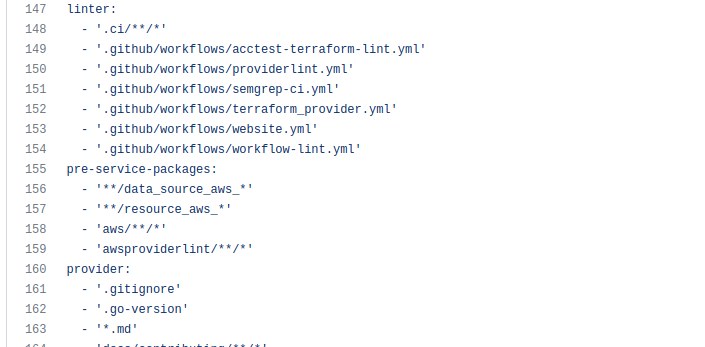

# **7.5. Написание собственных провайдеров для Terraform.**

# *Задача 1.*

Потренируемся читать исходный код AWS провайдера.

1. Найдите, где перечислены все доступные resource и data_source, приложите ссылку на эти строки в коде на гитхабе.

Все доступные resource и data_source перечислены здесь (строки 156, 157):

```
https://github.com/hashicorp/terraform-provider-aws/blob/main/internal/generate/prlabels/main.go
```



2. Для создания очереди сообщений SQS используется ресурс aws_sqs_queue у которого есть параметр name.

 - С каким другим параметром конфликтует name? Приложите строчку кода, в которой это указано.

Параметр 'name' конфликтует с параметром 'name_prefix'

 ```
	ConflictsWith: []string{"name_prefix"},
 ```

 - Какая максимальная длина имени?

```
 Если определено 'fifoQueue' то 75 символов, если нет, то 80 символов.
```

 - Какому регулярному выражению должно подчиняться имя?

 'name' должно подчиняться регулярному выражению:

 ```
 regexp.MustCompile(`^[a-zA-Z0-9_-]{1,75}\.fifo$`)
 ```
 Если определено 'fifoQueue' или

 ```
regexp.MustCompile(`^[a-zA-Z0-9_-]{1,80}$`)
 ```

 если 'fifoQueue' не определено.